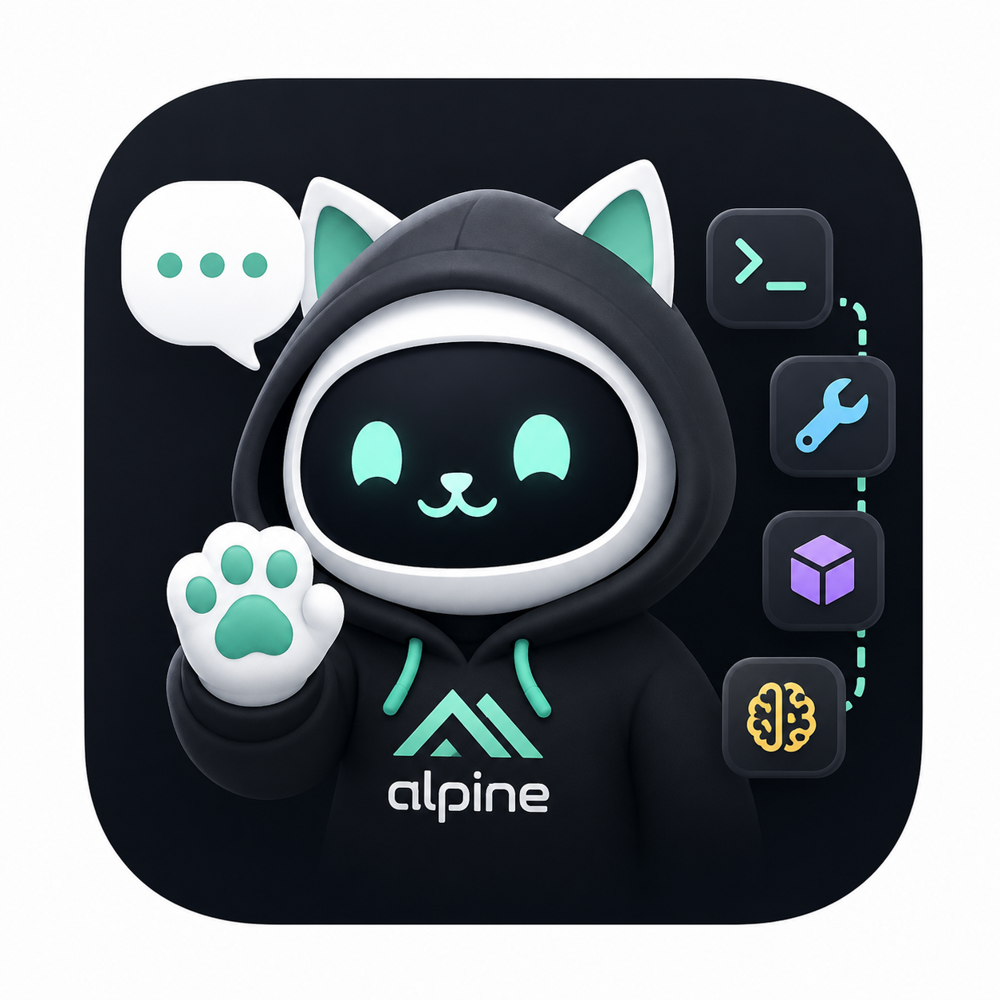

# ClawChat

[](https://www.gnu.org/licenses/gpl-3.0)
[](https://www.android.com/)
[](https://flutter.dev/)

<p align="center">
  
</p>

> **ClawChat** — Android 上的 AI Agent 聊天应用。内置 Alpine Linux 环境，支持工具调用、技能扩展、多模型切换。

---

## Features

### AI 对话
- **多模型支持** — Anthropic Claude、OpenAI、DeepSeek、OpenRouter、xAI 等，支持 OpenAI 兼容 API
- **Per-session 模型** — 每个会话独立选择模型，从 API 自动拉取可用模型列表
- **Extended Thinking** — 思考强度可调（关闭 / 低 / 中 / 高 / 最大）
- **流式输出** — 实时逐字显示，50ms 帧节流
- **Markdown 渲染** — 标题、加粗、代码块（语法高亮）、表格、引用、分隔线、链接
- **消息操作** — 长按 / ⋯ 按钮支持复制、复制 Markdown、分享、分支、引用；菜单支持重新生成、多模型对比、切换模型、系统提示词

### 工具调用
- **Bash** — 在 Alpine Linux 环境中执行命令，默认工作目录为 `/root/workspace`，但命令可访问整个 Alpine rootfs
- **Read File** — 读取工作区文件
- **Write File** — 写入工作区文件
- **Web Fetch** — 抓取网页内容（SSRF 防护）

### 技能系统
- **9 个预设技能** — GitHub、Google Calendar/Gmail/Drive、代码审查、翻译、网页搜索、文件管理、系统信息
- **技能导入** — 支持 URL（Git 仓库）和本地文件（tar.gz/zip）导入
- **环境变量** — 为技能配置 API Key 等敏感信息

### 输入方式
- **语音输入** — 长按麦克风，系统级语音识别
- **文件附件** — 图片和文件导入到工作区
- **快捷模板** — 翻译、总结、解释代码、写邮件等一键预设
- **多行输入** — 自动扩展，最多 5 行
- **草稿保存** — 切换会话自动保存/恢复输入内容

### 会话管理
- **多会话** — 创建、切换、重命名、删除、批量清空
- **搜索** — 按标题搜索历史会话
- **导出** — 会话导出为 Markdown（通过系统分享或剪贴板）

### 设置
- **深色模式** — 跟随系统 / 浅色 / 深色
- **字体大小** — 80% ~ 140% 可调
- **上下文长度** — 50K / 100K / 200K 字符
- **温度** — 0.0（精确）~ 1.0（创意）
- **自动压缩** — 超出上下文时自动截断旧消息
- **API Key 加密存储** — Android Keystore 加密

### 适配
- **折叠屏** — 展开时左侧会话列表 + 右侧聊天双栏布局
- **普通手机** — 标准单栏布局
- **键盘适配** — 键盘弹出时内容自动上推

---

## Screenshots

See the Releases page for the latest screenshots.

---

## Architecture

```
┌─────────────────────────────────────────┐
│           Flutter App (Dart)            │
│  ┌──────────┐ ┌──────────┐ ┌────────┐  │
│  │  Chat    │ │ Settings │ │Terminal│  │
│  │  Screen  │ │  Screen  │ │ Screen │  │
│  └────┬─────┘ └────┬─────┘ └───┬────┘  │
│       │            │           │        │
│  ┌────┴────────────┴───────────┴──────┐ │
│  │        Native Bridge (Kotlin)      │ │
│  └────────────────┬───────────────────┘ │
└───────────────────┼─────────────────────┘
                    │
┌───────────────────┼─────────────────────┐
│  proot            │        Alpine Linux │
│  ┌────────────────┴──────────────────┐  │
│  │  BusyBox + Bash + Python3 + Git   │  │
│  │  /root/workspace/ (工作区)         │  │
│  │  /root/workspace/skills/ (技能)    │  │
│  └───────────────────────────────────┘  │
└─────────────────────────────────────────┘
```

---

## Quick Start

### Download APK

从 [Releases](https://github.com/ankadada/ClawChat/releases) 下载最新 APK。

首次使用流程：
1. 安装 APK
2. 运行 Setup Wizard 初始化 Alpine 环境
3. 配置 API Key 和模型
4. 打开聊天或终端开始使用

### Build from Source

```bash
git clone https://github.com/ankadada/ClawChat.git
cd ClawChat

# Canonical release build: fetches and verifies PRoot before the build,
# then verifies the packaged APK before reporting success.
bash scripts/build-apk.sh
```

Releases are APK-only. Android App Bundle publication is intentionally disabled
until the repository has a post-package base-module and delivery verifier with
the same fail-closed PRoot guarantees. PRoot binary provenance and licenses are
recorded in [THIRD_PARTY_NOTICES.md](THIRD_PARTY_NOTICES.md).

---

## Requirements

| 要求 | 详情 |
|------|------|
| Android | 10+ (API 29) |
| 存储 | 初始 Alpine minirootfs 下载约 5MB；安装运行时软件包后约 300-500MB |
| 架构 | arm64-v8a, armeabi-v7a, x86_64 |

---

## Configuration

### API 设置
1. 打开 App → 设置
2. 打开“连接”
3. 选择 API 格式（Anthropic / OpenAI 兼容）
4. 输入 API Key 和 Base URL
5. 点击刷新按钮拉取可用模型

### 技能安装
1. 设置 → 更新与扩展 → 技能与扩展
2. 或通过 URL 导入自定义技能
3. GWS 技能需配置 `GOOGLE_ACCESS_TOKEN` 环境变量

## Project documentation

- [Architecture](ARCHITECTURE.md)
- [Design and interaction contract](DESIGN.md)
- [OpenClaw to ClawChat migration archive](docs/migrations/openclaw-to-clawchat.md)

---

## Security

- API Key 使用 Android Keystore 加密存储
- Shell 命令默认从 `/root/workspace` 执行，并带有敏感文件保护
- TLS 证书校验 + API Host 白名单
- 输出自动脱敏（API Key、密码模式）
- SharedPreferences 已从 Android 备份中排除

---

## License

GPL-3.0 License - see [LICENSE](LICENSE) file for details.

---

<p align="center">
  <b>ClawChat</b> — AI on your pocket
</p>
