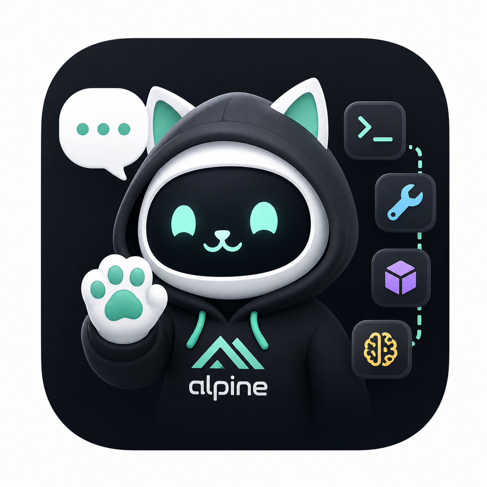

# ClawChat

[](https://www.gnu.org/licenses/gpl-3.0)
[](https://www.android.com/)
[](https://flutter.dev/)

<p align="center">
  
</p>

> **ClawChat** — Android 上的口袋个人 Agent：内置 Alpine Linux 工作区，可通过 Android API 读取日历 / 短信 / 联系人、执行闹钟与分享等手机动作，支持工具调用、技能扩展、多模型切换。

---

## Features

### AI 对话
- **多模型支持** — Anthropic Claude、OpenAI、DeepSeek、OpenRouter、xAI 等，支持 OpenAI 兼容 API
- **Per-session 模型** — 每个会话独立选择模型，从 API 自动拉取可用模型列表
- **Extended Thinking** — 思考强度可调（关闭 / 低 / 中 / 高 / 最大）
- **流式输出** — 实时逐字显示，50ms 帧节流
- **Markdown 渲染** — 标题、加粗、代码块（语法高亮）、表格、引用、分隔线、链接
- **消息操作** — 长按 / ⋯ 按钮支持复制、复制 Markdown、分享、分支、引用；菜单支持重新生成、多模型对比、切换模型、系统提示词

### 工具调用
- **Bash** — 在 Alpine Linux 环境中执行命令，默认工作目录为 `/root/workspace`
- **Read / Write File** — 读写工作区文件
- **Web Fetch / Web Search** — 抓取网页与网页搜索（SSRF 防护）
- **手机数据（phone_read）** — 读取日历、短信与联系人。首次使用对应数据时请求系统权限；返回受时间窗口和条数上限约束，日历描述中的链接、邮箱与 `tel:` 会被脱敏；短信不常驻后台监听
- **手机动作（phone_act）** — 闹钟、打开网页、分享、导航、拨号面板、写邮件、相机、日历界面；直接写入日历仍需确认
- **外发（phone_send，默认关闭）** — 打电话与发短信需在“手机数据与动作 → 外发”中单独开启；读取权限永不隐含发送权限
- **不可信数据防护** — 来自短信 / 日历 / 联系人 / 网页的内容被标记为不可信，不能单独驱动外发、跳转其他应用或把数据发到网络

### 本地自动化
- **计划执行** — 为已批准的本地任务排下次执行时间（一次性或 15–1440 分钟间隔），支持暂停 / 继续 / 删除与执行历史、失败重试信息。计划只记录时间和任务引用，到期后仍需在任务中心手动确认才会执行，不会自动发送或调用模型。入口：任务中心右上角或 设置 → 数据管理 → 计划执行
- **记忆可见性** — 记忆管理逐条显示来源与信任状态（用户确认 / 来自 web、phone、mcp），可单条删除；聊天命令面板的“本轮记忆”显示最近一次回复实际注入的记忆快照；每个会话可单独开关记忆（与全局一致时回退为“跟随全局”），会话覆盖保存在加密应用私有存储、损坏时按关闭处理。不可信来源与 taint 规则不变，信任记录不可读时整体 fail-closed
- **工作流模板** — 内置 2 个本地模板（每日工作总结、日程提醒草稿），安装前预览所需权限、是否联网、会接触的隐私数据，以及安装会写入的 capability 清单；安装写入 `workspace/skills/<id>/SKILL.md` + 受控 `skill.json`（带 sha256 自校验），安装后默认禁用，启用必须走既有技能同意（无 grant 时拒绝启用），并可按包回滚；运行期由既有能力策略执行（未声明的工具被拒绝，文件权限仍是显式拒绝）。模板正文在应用内编译，不含远程地址或下载

### 技能与扩展
- **可选技能包** — 内置 Google Calendar / Gmail / Drive、网页搜索、文件管理、机器健康等预设，默认不启用，需要通过旧版技能授权后再开启。Google 相关包调用 Google API，需要你自备 `GOOGLE_ACCESS_TOKEN`，应用内不做 OAuth，也不是读取手机日历/邮箱的路径（问手机日历用 `phone_read`）。GitHub、翻译、代码审查已移出应用包，放在 `docs/skill-examples/` 作为示例。
- **技能导入** — 支持 URL（Git 仓库）和本地文件（tar.gz/zip）导入
- **环境变量** — 为技能配置 API Key 等敏感信息

### 输入方式
- **语音输入** — 长按麦克风，系统级语音识别
- **文件附件** — 图片和文件导入到工作区
- **快捷模板** — 翻译、总结、解释代码、写邮件等一键预设
- **多行输入** — 自动扩展，最多 5 行
- **草稿保存** — 切换会话自动保存/恢复输入内容

### 会话管理
- **多会话** — 创建、切换、重命名、删除、批量清空
- **搜索** — 按标题搜索历史会话
- **导出** — 会话导出为 Markdown（通过系统分享或剪贴板）

### 设置
- **深色模式** — 跟随系统 / 浅色 / 深色
- **字体大小** — 80% ~ 140% 可调
- **上下文长度** — 50K / 100K / 200K 字符
- **温度** — 0.0（精确）~ 1.0（创意）
- **自动压缩** — 超出上下文时自动截断旧消息
- **API Key 加密存储** — Android Keystore 加密

### 适配
- **折叠屏** — 展开时左侧会话列表 + 右侧聊天双栏布局
- **普通手机** — 标准单栏布局
- **键盘适配** — 键盘弹出时内容自动上推

---

## Screenshots

See the Releases page for the latest screenshots.

---

## Architecture

```
┌─────────────────────────────────────────┐
│           Flutter App (Dart)            │
│  ┌──────────┐ ┌──────────┐ ┌────────┐  │
│  │  Chat    │ │ Settings │ │Terminal│  │
│  │  Screen  │ │  Screen  │ │ Screen │  │
│  └────┬─────┘ └────┬─────┘ └───┬────┘  │
│       │            │           │        │
│  ┌────┴────────────┴───────────┴──────┐ │
│  │        Native Bridge (Kotlin)      │ │
│  └────────────────┬───────────────────┘ │
└───────────────────┼─────────────────────┘
                    │
┌───────────────────┼─────────────────────┐
│  proot            │        Alpine Linux │
│  ┌────────────────┴──────────────────┐  │
│  │  BusyBox + Bash + Python3 + Git   │  │
│  │  /root/workspace/ (工作区)         │  │
│  │  /root/workspace/skills/ (技能)    │  │
│  └───────────────────────────────────┘  │
└─────────────────────────────────────────┘
```

---

## Quick Start

### Download APK

从 [Releases](https://github.com/ankadada/ClawChat/releases) 下载最新 APK。

首次使用流程：
1. 安装 APK
2. 运行 Setup Wizard 初始化 Alpine 环境
3. 配置 API Key 和模型
4. 打开聊天或终端开始使用

### Build from Source

```bash
git clone https://github.com/ankadada/ClawChat.git
cd ClawChat

# Canonical release build: fetches and verifies PRoot before the build,
# then verifies the packaged APK and production signer before reporting success.
bash scripts/build-apk.sh
```

Releases are APK-only. Android App Bundle publication is intentionally disabled
until the repository has a post-package base-module and delivery verifier with
the same fail-closed PRoot guarantees. PRoot binary provenance and licenses are
recorded in [THIRD_PARTY_NOTICES.md](THIRD_PARTY_NOTICES.md). The Android
production signing identity, release gate, and rotation procedure are recorded
in the [release signing contract](RELEASE_SIGNING.md).

---

## Requirements

| 要求 | 详情 |
|------|------|
| Android | 10+ (API 29) |
| 存储 | 初始 Alpine minirootfs 下载约 5MB；安装运行时软件包后约 300-500MB |
| 架构 | arm64-v8a, armeabi-v7a, x86_64 |

---

## Configuration

### API 设置
1. 打开 App → 设置
2. 打开“连接”
3. 选择 API 格式（Anthropic / OpenAI 兼容）
4. 输入 API Key 和 Base URL
5. 点击刷新按钮拉取可用模型

### 技能安装
1. 设置 → 更新与扩展 → 技能与扩展
2. 或通过 URL 导入自定义技能
3. GWS 技能需配置 `GOOGLE_ACCESS_TOKEN` 环境变量

## Project documentation

- [Architecture](ARCHITECTURE.md)
- [Design and interaction contract](DESIGN.md)
- [Local automation, memory visibility, workflow templates](docs/local-automation.md)
- [OpenClaw to ClawChat migration archive](docs/migrations/openclaw-to-clawchat.md)

---

## Security

- API Key 使用 Android Keystore 加密存储
- Shell 命令默认从 `/root/workspace` 执行，并带有敏感文件保护
- TLS 证书校验 + API Host 白名单
- 输出自动脱敏（API Key、密码模式）
- Android 系统备份（cloud backup / 设备迁移）：只包含聊天记录（`app_flutter/clawchat_sessions`）与白名单化的非敏感设置快照（`app_flutter/clawchat_settings_backup.json`）。快照含非秘密的供应商 profile 身份元数据（id / 名称 / 模型 / 采样参数，不含 API Key 与 baseUrl），以便恢复后模型组与当前选择仍可解析；恢复在首次启动时等待全部写入完成后才记录 fresh 标记。`FlutterSharedPreferences.xml` 一律排除，避免升级前遗留的明文 `api_key` / `env_vars` 进入备份；API Key、环境变量、供应商档案、MCP 配置等凭据存放在加密的 FlutterSecureStorage 中，同样不会被备份或恢复

---

## License

GPL-3.0 License - see [LICENSE](LICENSE) file for details.

---

<p align="center">
  <b>ClawChat</b> — AI on your pocket
</p>
