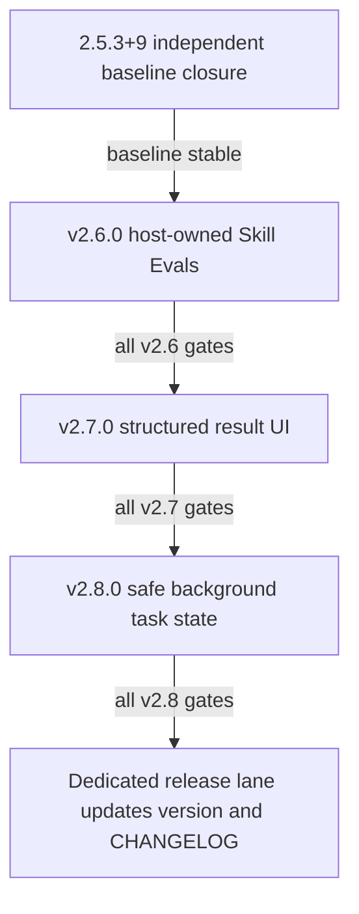

# ClawChat v2.6.0-v2.8.0 Agent Quality, Result UI, and Safe Background Tasks Plan

**Status:** Approved implementation SSOT. This document is planning-only: none
of v2.6.0, v2.7.0, or v2.8.0 is implemented, tested, released, or approved by
virtue of this file.

**Date:** 2026-07-15
**Applies to:** `/Users/lfxanka/Desktop/tool/ClawChat`
**Implementation order (fixed):** v2.6.0 Skill Evals -> v2.7.0 Structured
Result UI -> v2.8.0 Safe Background Tasks.

## 1. Decision and release rule

This is the single source of truth for the three versions below. An
implementation may add design notes or tests, but may not weaken, reorder, or
silently reinterpret a contract in this document. Conflicting implementation
notes are defects to resolve before merge.

The version number is a release contract, not a branch name:

| Version | Fixed capability boundary | May depend on |
| --- | --- | --- |
| `2.6.0` | Host-owned Skill Evals and inert-content device import checks | `2.5.3+9` baseline only |
| `2.7.0` | Strict structured-result data UI and action receipts | merged `2.6.0` gates |
| `2.8.0` | Dart-only durable background-task state, preview, dry-run, and recovery | merged `2.6.0` and `2.7.0` gates |

No version is released merely because its branch is merged. A dedicated release
lane may update `flutter_app/pubspec.yaml` and `CHANGELOG.md` only after that
version's Definition of Done has passed and evidence is recorded. Until then,
the release version remains the existing baseline.



## 2. Current repository truth and evidence

The baseline is intentionally described before proposing new surfaces. The
evidence below describes the checked working tree, not a claim that future
versions exist.

| Topic | Current checked fact | Evidence |
| --- | --- | --- |
| Release baseline | The current Flutter package reports `2.5.3+9`. | `flutter_app/pubspec.yaml:4` |
| Global tool hard-deny | `ToolPolicy.denyFor` rejects configured tool names, shell deny patterns, and extra deny checks before its `approve` path. | `flutter_app/lib/services/tools/tool_policy.dart:62-93` |
| Skill capability is additive | `SkillCapabilityPolicy` explicitly says it is an additional boundary ahead of `ToolPolicy`, and cannot turn a global deny or approval prompt into an allow. | `flutter_app/lib/services/skill_capability_policy.dart:17-22` |
| Existing manifest compatibility | Only manifest schema version `1` is accepted; unknown root keys are rejected. | `flutter_app/lib/models/extension_manifest.dart:10-12`, `flutter_app/lib/models/extension_manifest.dart:47-70` |
| Bundled skill posture | All nine checked-in presets currently contain only `SKILL.md`; preset installation therefore treats them as legacy, disabled-until-consent packages with empty effective capabilities. v2.6 must evaluate the real bundled assets rather than pass only synthetic fixtures. | `flutter_app/assets/skills/*/SKILL.md`, `flutter_app/lib/services/skill_service.dart:1284-1302`, `flutter_app/lib/models/extension_manifest.dart:488-504` |
| Existing import bounds | The current importer already caps the downloaded archive at 25 MiB, extracted content at 20 MiB/512 entries, `SKILL.md` at 1 MiB, and `skill.json` at 256 KiB. | `flutter_app/lib/services/skill_service.dart:458-467`, `flutter_app/lib/services/skill_service.dart:1355-1360`, `flutter_app/lib/services/skill_service.dart:2066-2108` |
| Existing operation identity | `AgentService` creates a fresh UUID operation ID for every model tool-use block. | `flutter_app/lib/services/agent_service.dart:359-393` |
| Existing policy sequence | A tool attempt checks hard deny before approval; a denied/failed approval is fail-closed, then execution is tracked as approved-not-started and started. | `flutter_app/lib/services/agent_service.dart:614-723` |
| Existing recovery vocabulary | The provider already distinguishes proposed, approval-pending, started, completed, persisted-result, and interrupted-unknown transitions. | `flutter_app/lib/providers/chat_provider.dart:5712-5738` |
| Current foreground service | `AgentTaskService.start` starts a service for a session; the Android manifest declares it as a non-exported special-use foreground service for user-initiated agent work. | `flutter_app/android/app/src/main/kotlin/com/anka/clawbot/AgentTaskService.kt:123-136`, `flutter_app/android/app/src/main/AndroidManifest.xml:77-84` |
| Current FGS identity gap | Native active/notification state is keyed primarily by session ID, while ChatProvider starts/stops service state per session. v2.8 therefore cannot safely share it with task work until owner-scoped leases land. | `flutter_app/android/app/src/main/kotlin/com/anka/clawbot/AgentTaskService.kt:462-479`, `flutter_app/android/app/src/main/kotlin/com/anka/clawbot/AgentTaskService.kt:879-902`, `flutter_app/lib/providers/chat_provider.dart:849-976` |
| Current trace boundary | Run-trace export labels itself `metadata_only` and `memory_only`; traces are cleared when tracing is disabled. | `flutter_app/lib/services/run_trace_export_service.dart:15-24`, `flutter_app/lib/services/runtime_debug_events.dart:319-353` |
| Developer-mode gate | Developer mode is off unless explicitly persisted, and `ChatProvider` uses it to enable runtime tracing. | `flutter_app/lib/services/preferences_service.dart:1083-1088`, `flutter_app/lib/providers/chat_provider.dart:460-465` |

The Android manifest currently contains a `RECEIVE_BOOT_COMPLETED` permission
at `flutter_app/android/app/src/main/AndroidManifest.xml:10`; that permission
is not authorization to implement boot resume. v2.8 explicitly prohibits a
boot receiver, boot resume, or scheduler-triggered execution regardless of
that pre-existing declaration. The current Android manifest also contains a
`CommandCleanupJobService` declaration at lines 86-89. That cleanup service is
not a v2.8 execution scheduler and must not be repurposed as one.

## 3. Global product, security, and release boundaries

### 3.1 Non-goals for all three versions

- Preserve local-first operation: no required account, cloud backup/sync,
  hosted control plane, remote policy authority, or remote telemetry is added.
- Never upload raw prompts, tool inputs, tool outputs, task payloads, secrets,
  recipient data, or action receipts. Diagnostic trace remains local,
  metadata-only, and gated by explicit Developer Mode.
- An eval result, a skill's self-authored test case, a result-UI action, or a
  recovered task record never grants tool, network, filesystem, subprocess,
  Android, or external-send permission.
- Existing `ToolPolicy`, `SkillCapabilityPolicy`, and per-call approval remain
  the execution authority. New features compose with them; they do not create
  an alternative allow path.
- This roadmap does not redesign model providers, chat persistence, terminal
  direct-launch behavior, Android permissions, or the existing foreground
  service lifecycle outside the narrow integration required by a later version.
- No version introduces scheduler-originated or headless model execution,
  unattended external sends, JavaScript execution, arbitrary shell execution,
  a remote eval runner, or an on-device model/tool runner for imported skills.
  A foreground-user-started run may continue while the app UI is backgrounded
  under the existing foreground-service contract; that is not authority to
  start or resume it after process loss or reboot.

### 3.2 Isolation and ownership rule

1. The user's `2.5.3+9` signing/release/UI work closes independently. It is
   not rebased, formatted, tested as part of these lanes, or used as proof that
   a roadmap version works.
2. Each implementation lane starts from its approved predecessor in a separate
   worktree and branch: `feat/v2.6-skill-evals`,
   `feat/v2.7-structured-result-ui`, and
   `feat/v2.8-safe-background-tasks` (names may differ only if the release
   owner records the replacement in the lane evidence).
3. A lane must not stage, clean, reset, revert, or format unrelated user files.
4. The release lane is separate from feature lanes. It owns only final version
   number, `CHANGELOG.md`, artifact, and release evidence after the relevant
   functional gate; it does not repair feature code opportunistically.
5. QA/review lanes are read-only. They report `PASS`, `PARTIAL`, `BLOCKED`, or
   `FAIL` with commands and file:line evidence; they do not turn a skipped gate
   into a pass.

### 3.3 Shared authorization pipeline

Every new proposed action uses this immutable order:

1. Create a **fresh** `operationId` for this proposal. Re-clicking an action,
   retrying a task, recovering after process loss, or re-rendering a model
   result always creates a new operation identity; IDs are never recycled.
2. Canonicalize and bounds-check the action payload without executing it.
3. Run shared global hard deny (`ToolPolicy.denyFor`). A hard deny ends the
   operation with a persisted denied receipt and never presents a permissive
   approval path.
4. Run `SkillCapabilityPolicy.denyFor` when the action belongs to an active
   skill context. Its decision is additive and fail-closed.
5. Run the shared approval rule. The existing distinction stays intact:
   hard-deny means no execution; Ask produces an approval decision; Auto Allow
   applies only where the shared policy permits it; interruption/recovery can
   demand fresh approval.
6. Execute only after the preceding checks allow it. Persist a terminal receipt
   before the UI is allowed to claim a terminal outcome. If the execution
   boundary was crossed but a terminal receipt cannot be proved, persist
   `unknown_outcome`, do not retry automatically, and show recovery.

The order reflects the current hard-deny-before-approval implementation
(`agent_service.dart:658-703`) and the existing run-level recovery approval
override (`chat_provider.dart:1855-1869`). No v2 feature may bypass either.

## 4. Common data and persistence conventions

All future schemas below are UTF-8 JSON, deterministic after canonical key
ordering, and versioned independently. v2.6 introduces one shared
`StrictJsonDecoder`: `decodeBytes` validates raw UTF-8 for host eval/inventory
files and later v2.8 task-store records; `decodeString` validates Unicode scalar
sequence and JSON structure for the v2.7 inner `documentJson` after provider SDK
decoding. Both reject duplicate keys, unknown required-version semantics,
non-finite numbers, invalid Unicode, and oversized input before projection or
execution. No claim is made about original provider bytes that the SDK has
already decoded. Provider SDK outer tool
maps have already lost duplicate-key information and make no duplicate-key
guarantee; security-significant v2.7 data therefore lives inside
`documentJson`. Log and trace only stable IDs, schema versions, kind names,
lifecycle, result codes, and bounded counts; do not log user payloads.

| Field / rule | Contract |
| --- | --- |
| IDs | IDs use UUID/opaque identifiers. They are identifiers, not credentials or authorizations. |
| Timestamps | A shared `WireTimestamp` formatter emits exactly UTC `yyyy-MM-ddTHH:mm:ss.SSSZ`; its parser accepts only that canonical form. Invalid/missing timestamps fail parsing and never become "now". |
| Receipt retention | Receipts are local durable records subject to the app's local retention/deletion controls. No sync/upload is added. |
| Receipt body | Store only the minimum canonical action summary, policy decision code, receipt state, and local references needed for recovery; never persist raw secrets or external response bodies. |
| Idempotency | A receipt protects reconciliation for its single operation. It does not authorize repeating it. User retry creates a new operation and repeats the full pipeline. |
| Unknown schema | Future schema versions or unknown security-significant fields fail closed; the UI renders a local invalid-data notice without executable actions. |

### 4.1 Shared action receipt v1 contract

This frozen v1 contract is introduced with v2.7 and reused by v2.8. It is not
present in the current app and must be implemented with strict parsing and local
storage before either version can pass.

```json
{
  "schemaVersion": 1,
  "receiptId": "uuid",
  "operationId": "uuid",
  "source": {"kind": "structured_result", "resultId": "uuid", "actionId": "save-1"},
  "actionKind": "save_to_memory",
  "canonicalInputDigest": "sha256-hex",
  "createdAt": "2026-07-15T00:00:00.000Z",
  "updatedAt": "2026-07-15T00:00:01.000Z",
  "policy": {
    "hardDeny": "not_denied",
    "skillDeny": "not_applicable",
    "approval": "approved"
  },
  "state": "resultPersisted",
  "outcome": "success",
  "outcomeKnown": true,
  "safeSummary": "Saved local memory"
}
```

Receipt lifecycle reuses the existing `ToolAttemptLifecycle` vocabulary:
`proposed`, `approvalPending`, `approvedNotStarted`, `started`, `completed`,
`failed`, `interruptedUnknown`, and `resultPersisted`. Hard-deny, skill-deny,
and user-deny remain bounded policy/outcome reason codes rather than a second,
competing lifecycle enum. A terminal user-facing action claim requires
`resultPersisted`; `interruptedUnknown` is terminal for automatic execution but
not an assertion that the external effect did or did not happen.

## 5. v2.6.0 -- Skill Evals and safe import inspection

### 5.1 Objective and scope

v2.6.0 provides two separate, non-substitutable checks:

| Surface | Owner | Purpose | Explicitly cannot do |
| --- | --- | --- | --- |
| Repository / CI Skill Evals | Repository maintainers and CI | Verify deterministic corpus structure, trusted trigger-metadata coverage/collisions, and static contracts on a trusted host. | Claim provider-model routing/behavior, grant runtime permissions, validate an unreviewed device import, or treat a skill-owned case as authoritative. |
| Device import bounded checks | The app import path | Reject/flag structurally unsafe imports and show a bounded local summary before consent. | Execute `SKILL.md` scripts, shell, network, JavaScript, tools, model calls, or any skill behavior. |

`eval PASS != authorization` is a mandatory invariant. A passing repository
case, a passing import check, or a model assertion never changes the result of
`ToolPolicy`, `SkillCapabilityPolicy`, Android runtime permission, or per-call
approval. The implementation test suite must demonstrate this by pairing a
passing eval/import sample with a tool invocation that remains hard-denied or
approval-gated.

#### Repository / CI scope

- Host-owned structural lint for expected files, manifest v1 parsing, size
  bounds, and prohibited/unsupported declarations.
- Host-owned static scans for dangerous patterns in declaration and Markdown
  text. A scan report is a test result, not execution.
- Host-owned trigger-metadata cases covering positives, negatives, and
  near-misses. They lint trusted metadata for missing coverage and collisions;
  they do **not** claim to test the production model's skill choice. The current
  runtime exposes stable skill IDs rather than an executable deterministic
  router (`skill_service.dart:608-627`).
- Static instruction-contract checks for required sections and prohibited
  patterns. Model-generated response quality remains an on-demand behavioral
  eval until ClawChat has a separately approved production routing contract;
  it is not a deterministic CI PASS in v2.6.
- CI runs a closed corpus checked into the repository and fails on invalid
  schema, nondeterministic output, missing expected fixture, or changed
  golden result without reviewed corpus change.

#### Device import scope

- Parse manifest v1 and inspect only imported bytes and bounded metadata.
- Enforce structural, manifest, declared-capability, size, path/name, and
  known-malicious-pattern checks.
- Produce a local summary with `accepted`, `rejected`, or `needs_review`, a
  bounded list of rule IDs, and a capability summary. The summary contains no
  executable buttons that bypass consent/policy.
- Treat all imported scripts and content as inert data. Existing host-owned
  archive staging/extraction may use its fixed PRoot/Python implementation, but
  must never execute an archive-provided command, script, evaluator, tool,
  model call, JavaScript, or network request.

### 5.2 Host-owned corpus layout and case schema v1 contract

The following paths are **proposed v2.6 repository-owned paths**, not current
files and not installation locations:

```text
flutter_app/tool/skill_evals/
  bundled-skill-inventory.json
  schema/skill-eval-case.schema.json
  cases/
    positive/
    negative/
    near_miss/
  fixtures/
    skills/
  goldens/
  run_skill_evals.dart
```

Only repository owners modify `cases/`, `fixtures/`, and `goldens/`; CI uses
only those host paths. Installed skill directories, archive-local files, and
network-provided content are never discovered as CI cases. A case references a
fixture by fixed host-relative ID, not a path supplied by the skill.

`bundled-skill-inventory.json` is the mechanical bridge to what ships. Each
entry contains the exact asset directory, SHA-256 of the real `SKILL.md`, one
disposition (`manifest_v1_enabled`, `disabled`, or `removed`), and a bounded
user-visible reason for non-enabled entries. An enabled entry also contains the
real `skill.json` asset path and SHA-256. The runner enumerates
`flutter_app/assets/skills/` itself and fails on a missing/extra directory,
missing/extra inventory entry, digest mismatch, missing required case, or case
fixture whose bytes differ from the inventory asset. Synthetic fixtures may
exercise negative parser cases but can never satisfy bundled-skill coverage.

For `manifest_v1_enabled`, v2.6 must add both `SKILL.md` and `skill.json` to the
Flutter asset declarations, make preset installation copy and immediately
re-read both exact assets, and prove the installed scan plus activation policy
sees the same digests/capabilities. For `disabled` or `removed`, tests prove the
entry cannot enter `buildSkillIndex` and that the settings/catalog UI presents
the bounded reason. CI fails if an enabled asset lacks either file or if a
disabled/removed asset is exposed as enabled.

`skill-eval-case.schema.json` v1 contract (strict root object; `additionalProperties`
is false at every object level):

```json
{
  "$schema": "https://json-schema.org/draft/2020-12/schema",
  "title": "ClawChat host-owned skill eval case",
  "type": "object",
  "additionalProperties": false,
  "required": ["schemaVersion", "id", "fixtureId", "kind", "input", "expected"],
  "properties": {
    "schemaVersion": {"const": 1},
    "id": {"type": "string", "pattern": "^[a-z0-9][a-z0-9._-]{0,95}$"},
    "fixtureId": {"type": "string", "pattern": "^[a-z0-9][a-z0-9._-]{0,95}$"},
    "kind": {"enum": ["structure", "static_scan", "trigger_metadata"]},
    "input": {
      "type": "object",
      "additionalProperties": false,
      "required": ["text"],
      "properties": {
        "text": {"type": "string", "maxLength": 2048},
        "locale": {"type": "string", "pattern": "^[A-Za-z0-9-]{2,35}$"}
      }
    },
    "expected": {
      "type": "object",
      "additionalProperties": false,
      "required": ["decision", "reasonCode"],
      "properties": {
        "decision": {"enum": ["match", "no_match", "reject"]},
        "reasonCode": {"type": "string", "pattern": "^[a-z0-9._-]{1,96}$"},
        "selectedSkillId": {"type": "string", "pattern": "^[a-z0-9][a-z0-9._-]{0,127}$"}
      }
    }
  }
}
```

For a `match`, `selectedSkillId` is required by the runner. For `no_match` and
`reject`, it must be absent. A `trigger_metadata` match means only that the
host-owned metadata corpus identifies one intended skill without a near-miss
collision; it is not evidence that a provider model will select or follow that
skill. The runner checks exact JSON result equality after canonicalization;
timestamps, random IDs, host paths, and model prose are not allowed output
fields.

There is no v2.6 skill-supplied eval descriptor or sidecar. This deliberately
avoids an apparent but unsafe path where an imported skill chooses the test that
certifies itself. If a later version proposes a descriptor, it must be
non-authorizing, host-gated, and reviewed by a separate SSOT amendment; it
cannot alter the v2.6 compatibility rule below.

### 5.3 Device import contract

The v2.6 inspector preserves the current compatibility bounds. Tightening them
is a separate migration decision requiring evidence from real installed skill
packages; this quality-gate version must not silently turn valid imports into
failures:

| Check | Limit / behavior |
| --- | --- |
| Archive/file count | Reuse the existing maximum of 512 extracted entries. |
| Total bytes / individual file bytes | Reuse current 25 MiB download, 20 MiB extracted-content, 1 MiB `SKILL.md`, and 256 KiB `skill.json` limits; bounded previews use smaller display limits and never copy whole content into logs/UI. |
| Paths | Reject absolute paths, traversal, duplicate normalized archive members, symlinks, and entries outside the recognized skill layout. Duplicate-member detection occurs in the host-owned extractor before `extractall`; post-extraction inspection is not sufficient. |
| Manifest | Feed raw `skill.json` bytes through `StrictJsonDecoder`, then strictly parse existing manifest v1 only. Duplicate/unknown fields, unsupported versions, malformed JSON, or missing required fields reject. |
| Capabilities | Normalize and summarize declarations; reject invalid/unsupported values. A declaration is not a grant. |
| Content scan | Scan only bounded text/bytes for fixed forbidden patterns and record rule IDs. No interpretation or execution follows a scan result. |
| Summary | Report at most 16 rule IDs and 1,024 displayed characters. Unknown/oversized values are summarized as rejected rather than copied to UI/logs. |

The implementation must separate `ImportInspectionResult` from
`VerifiedSkillUse`. The former contains only import verdict/rule IDs/summary;
it cannot be passed to `SkillCapabilityPolicy.activate`, `load_skill`, or a
tool registry. Consent and verified activation keep their existing own gates.
`rejected` never reaches `installPreparedSkill`. `needs_review` may proceed only
to the existing explicit consent UI; it is informational, is never copied into
an activation/grant authority, and cannot weaken digest recheck or runtime
policy.

### 5.4 Compatibility and migration

- v2.6 does **not** require manifest v2. Existing valid manifest v1 remains the
  only accepted manifest contract, matching the current parser.
- No imported data is silently rewritten to a new manifest shape. The importer
  either accepts v1 for the normal consent path, rejects it with bounded reason
  IDs, or asks the user to review an informational summary.
- Eval corpus files are host-only test fixtures and never copied into the skill
  install directory; uninstalling a skill cannot delete the corpus.
- A legacy v1 skill with no eval data remains installable only under existing
  validation and consent rules. It neither fails nor passes an eval by default.

#### Bundled-skill closure

Every checked-in directory under `flutter_app/assets/skills/` is part of the
v2.6 host corpus; CI may not silently skip one. Before v2.6 can pass, each
bundled skill must have an explicit disposition backed by tests:

1. migrate it to a checked-in manifest v1 and instructions that are actually
   enforceable by the current runtime policy; or
2. mark it unsupported/disabled or remove it from the bundled catalog with a
   user-visible reason.

The quality gate must fail if a bundled skill advertises tools, commands,
domains, secrets, filesystem access, or response behavior that its effective
manifest and current `SkillCapabilityPolicy` cannot enforce. Expanding the P0
command/filesystem allow surface merely to make an old preset pass is not part
of v2.6.

### 5.5 v2.6 slices and acceptance

| Slice | Owner boundary | Required evidence |
| --- | --- | --- |
| Inventory/corpus/schema/runner | Host/CI lane | Actual asset enumeration and SHA-256 binding, disposition closure, strict JSON/schema validation, deterministic golden comparison, positive/negative/near-miss count and command output. |
| Static import inspector | Flutter security lane | Tests prove no imported code/evaluator/network/tool/model call executes; host-owned fixed staging/extraction remains allowed; malformed/archive/path/capability tests pass. |
| Consent/policy regression | Flutter policy lane | A passing eval/import sample still encounters the existing hard-deny/Ask/Auto/recovery matrix. |
| QA | Read-only QA lane | Re-run CI-style corpus and focused import/policy tests; inspect no unowned fixtures are discovered. |

**v2.6 Definition of Done:** all required slices report `PASS`; CI uses only
host-owned cases; deterministic corpus output is pinned; device inspection is
proven not to execute imported content; all nine bundled skill directories have
an exact asset digest plus passing or intentionally-disabled/removed disposition;
enabled presets ship/copy/re-read manifest v1 and disabled/removed presets cannot
enter the model index; v1 compatibility
passes; the explicit
`eval PASS != authorization` regression passes; Markdown/schema/style checks
pass; release evidence is complete. At planning time: **BLOCKED / NOT RUN** --
there is no implementation or test evidence in this docs-only lane.

## 6. v2.7.0 -- Structured Result UI

### 6.1 Objective and scope

v2.7.0 permits a model to propose bounded **data**, not UI behavior. The client
owns strict parsing, localization/projection, all rendering, and every action
handler. There are exactly four initial block kinds:

`notice`, `key_value`, `item_list`, and `action_list`.

The only v2.7 model ingress is a new app-owned safe presentation tool named
`present_structured_result`. Its outer tool schema has exactly one semantic
parameter, `documentJson`, a string whose UTF-8 length is at most 16 KiB. The
shared raw-byte strict decoder parses that inner string using the wire contract
below, so duplicate keys survive provider SDK Map conversion and can be
rejected. `present_structured_result` uses a tested strict-no-repair preflight
path; generic `ToolArgumentPreflight` coercion/repair must not change
`documentJson`. Duplicate-key rejection is guaranteed for the inner document,
not for the provider's already-parsed outer envelope.

Calling the tool proposes a `StructuredResultContent`; it does not execute an
action and does not infer structured data from ordinary prose or a
provider-specific opaque response field. Malformed outer input or inner JSON
returns a bounded error tool acknowledgement and stores/renders no result.

Out of scope: HTML, Markdown/JS rendering, remote components, arbitrary links,
arbitrary deep links, arbitrary tool invocation, unknown block plug-ins,
model-supplied callbacks, result schema version negotiation, and any action
that skips the shared authorization pipeline.

### 6.2 Strict wire schema v1 contract

Maximum inner `documentJson` size is **16 KiB UTF-8**. The root accepts exactly
`schemaVersion`, `resultId`, and `blocks`; duplicate keys and additional root
fields reject the whole document. A failed parse yields one local
non-actionable `notice` stating `invalid_structured_result` and records only a
metadata-only reason code.

```json
{
  "schemaVersion": 1,
  "resultId": "uuid",
  "blocks": [
    {"kind": "notice", "level": "info", "text": "Imported safely"},
    {"kind": "key_value", "items": [{"key": "Skill", "value": "weather"}]},
    {"kind": "item_list", "title": "Checks", "items": ["Manifest v1"]},
    {
      "kind": "action_list",
      "actions": [
        {"actionId": "save-1", "label": "Save to local memory", "kind": "save_to_memory", "payload": {"fact": "Skill review: imported safely"}}
      ]
    }
  ]
}
```

Required parser rules:

| Element | Allowed fields and bounds | Unknown / invalid behavior |
| --- | --- | --- |
| Root | `schemaVersion == 1`; UUID `resultId`; `blocks` array of 1--32 blocks | Reject whole result and show invalid-data notice. |
| `notice` | `kind`, `level` in `info`, `warning`, `error`; `text` of 1--2,000 Unicode scalar values | Reject whole result. No markup interpretation. |
| `key_value` | `kind`, `items`; 1--32 items, each exact `key`/`value`, each 1--256 characters | Reject whole result. Preserve item order. |
| `item_list` | `kind`, optional `title` up to 160 characters, `items` of 1--64 strings each up to 512 characters | Reject whole result. No nested blocks or objects. |
| `action_list` | `kind`, `actions`; 1--16 actions | Reject whole result. No partial action rendering. |
| Action | exact `actionId`, `label`, `kind`, `payload`; ID 1--96 ASCII `[a-z0-9._-]`; label 1--160; payload encoded size <= 2 KiB | Reject whole result. Unknown action kind never falls back to link/tool execution. |

`action.kind` must be in a client-owned allowlist introduced with the code. The
model cannot define a new kind. `payload` is parsed by the specific registered
handler with its own exact schema; unrecognized payload fields reject that
result. Text is rendered as text, escaped by the UI toolkit, with no HTML,
Markdown, raw URL auto-linking, or rich-text callback supplied by the model.

### 6.3 Durable ownership and tool-history handoff

ChatSession and SessionStorage are the single durable owners in v2.7:

- `StructuredResultContent` is a new versioned `MessageContent` stored alongside
  the matching `present_structured_result` `ToolResultContent` in the same
  user-role message. `resultId` is unique within a session and `actionId` is
  unique within its result.
- `ChatSession.structuredActionReceipts` is a bounded versioned list keyed by
  unique `operationId` and referencing `resultId`/`actionId`. It is serialized
  in the same session JSON, so a single ordered SessionStorage save owns card
  plus receipt consistency. Deleting a session deletes both; ordinary local
  retention/export rules apply, with raw action secrets/external bodies omitted.
  The list is capped at 256 entries; reaching the cap disables new card actions
  with a local explanation rather than pruning recovery evidence or executing
  without a receipt.
- `present_structured_result` is intercepted by AgentService and delivered
  through a typed, awaited callback to a ChatProvider sink. Generic `Tool`
  implementations never write SessionStorage. The sink validates current
  session/run ownership, adds the validated result beside the matching tool
  result, and durably saves the session before AgentService emits a success
  acknowledgement. A failed/stale save returns a bounded tool error and cannot
  leave a visible card claiming success.
- API chronology remains the original assistant `tool_use` followed by user
  `tool_result`. `StructuredResultContent.toJson` stores the validated UI data,
  while `ChatMessage.toApiJson` omits that UI-only block. The matching tool
  result `forLlm` contains the bounded deterministic projection, so later model
  context retains meaning without an unknown provider content type.
- An action receipt is saved at every authority boundary. The proposed or
  approval-pending receipt is saved before prompting; `started` is saved before
  crossing the effect boundary; `resultPersisted` is saved before the card may
  render success/failure. Save failure before `started` prevents execution.
  Missing terminal evidence becomes `interruptedUnknown`; it is never replayed.

The card renderer derives state only from the session's receipts. It never
stores raw model UI data in generic tool metadata and never treats the model's
own completion text as an action outcome.

### 6.4 Deterministic text projection

Every valid structured result must have a stable, accessible plain-text
projection used for screen readers, copy/export, unsupported layouts, and
test goldens:

```text
NOTICE [info]: Imported safely
DETAILS:
- Skill: weather
CHECKS:
- Manifest v1
ACTIONS:
- Save to local memory
```

Projection rules are fixed: blocks retain wire order; `key_value` and list
items retain array order; labels are normalized for whitespace; control
characters are escaped/replaced; no action payload, ID, URL, secret, or
internal reason code appears in user text. An invalid schema projects exactly
one `NOTICE [error]: Structured result could not be displayed safely.` and no
actions.

### 6.5 Action and receipt contract

An `action_list` is a proposal, not a capability. On every tap the renderer
must:

1. derive a canonical, bounds-checked action request from the registered
   handler;
2. allocate a new `operationId`, even for the same `resultId`/`actionId`;
3. execute the shared hard-deny -> skill-deny -> approval -> execute ->
   persisted-receipt sequence from section 3.3;
4. disable only the in-flight tap instance, not future explicit retries; and
5. render the receipt state, never a model-authored completion assertion.

`StructuredActionRegistry` is app-owned. Every allowed action kind resolves at
tap time to exactly one currently registered `ToolRegistry` tool name, its
strict input schema, `ToolRisk`, and executor. The registry may expose only
explicitly opted-in tools; unknown/unavailable actions fail closed. It cannot
store a generic Flutter callback or bypass `ToolApprovalRequest`. A future
local-only action requires its own policy-recognized typed registry contract;
it is not silently added as a UI callback in v2.7.

The initial v2.7 registry contains exactly one action kind:
`save_to_memory`, mapped to the existing `memory_write` tool with an exact
`fact` payload schema and the tool's current risk/approval policy. Bash,
MCP, filesystem, phone/device intent, network, and arbitrary tool-name actions
are not structured-result-exposable in v2.7. Expanding this list is a reviewed
registry/code change with its own tests, never model data.

The receipt must bind `resultId`, `actionId`, resolved tool name, registered
action kind, fresh
`operationId`, sanitized payload digest, policy decisions, timestamps, and
outcome. It must not store arbitrary model text or credentials. A stale
approval/notification decision whose operation ID does not equal the current
request is ignored, matching the current pending approval identity guard at
`flutter_app/lib/providers/chat_provider.dart:1907-1917`.

If `present_structured_result` is invoked inside an active skill context, the
result stores the verified skill ID/trust digest provenance. The skill manifest
must declare `present_structured_result`, and every later action reruns
`SkillCapabilityPolicy` against that current digest. Missing/stale provenance is
non-actionable and requires the skill to be reactivated/re-consented; no card
inherits the presentation tool's approval.

### 6.6 Migration and UI compatibility

- Existing unstructured text/tool results remain unchanged. A response is
  structured only after a valid `present_structured_result` tool call with
  `schemaVersion: 1`; it is never inferred from ordinary prose.
- Persisted messages preserve their original representation. Do not rewrite
  legacy messages during app startup. A malformed stored structured payload is
  projected as the safe invalid-data notice with no actions.
- The first release supports only schema v1. New schema versions are safely
  non-actionable until their parser, projection, tests, and migration are
  deliberately added in a later version.
- The UI must pass narrow, wide, foldable book/tabletop/hinge, keyboard, and
  200% text-scale tests. The plain-text projection is the fallback if the
  enhanced layout cannot fit without overlap.

### 6.7 v2.7 slices and acceptance

| Slice | Owner boundary | Required evidence |
| --- | --- | --- |
| Strict decoder/schema/projection | Dart data-contract lane | Inner `documentJson` exact-golden tests; duplicate/unknown field/kind/action/oversize rejection; strict-no-repair outer preflight; deterministic plain-text tests. |
| Renderer/accessibility | Flutter UI lane | Four block kinds only; semantic labels; text-scale/IME/foldable screenshots or widget geometry assertions; invalid result has no tappable action. |
| Session ownership/action bridge/receipt | Shared policy lane | Typed AgentService-to-ChatProvider sink; single-session atomic card/receipt saves; API tool chronology; fresh ID per tap; hard deny, skill deny, Ask, Auto where eligible, recovery reauthorization, stale decision, persisted receipt, and unknown outcome tests. |
| QA | Read-only QA lane | Schema fuzz/bound tests plus focused UI/policy tests against the merged worktree. |

**v2.7 Definition of Done:** all required slices report `PASS`; schema accepts
only the four fixed block types and their bounds; malformed/unknown data is
non-actionable; text projection is deterministic; every action gets a fresh ID
and same-session persisted receipt through the typed sink/shared policy; API
history retains valid tool-use/result chronology; foldable/IME/200% accessibility
tests pass; migration preserves legacy text; release evidence is complete. At
planning time: **BLOCKED / NOT RUN**.

## 7. v2.8.0 -- Safe Background Tasks

### 7.1 Objective and hard boundary

v2.8.0 adds a **Dart durable state machine, local storage, preview, dry-run,
and recovery UI** for user-created background task plans. A task explicitly
started while the app is foregrounded may continue when the UI moves to the
background under the existing foreground-service lifecycle. It does not add an
Android scheduler or unattended execution engine, and it cannot start or resume
after process loss or reboot.

Specifically, v2.8.0 must not introduce or enable:

- WorkManager or any `androidx.work` dependency;
- AlarmManager alarms for task execution;
- a boot receiver, boot resume, `RECEIVE_BOOT_COMPLETED`-driven task start, or
  any resumption after device reboot;
- headless Dart isolates, scheduler-originated Dart callbacks/model/tool calls,
  or any task start that did not originate from a current foreground user
  action;
- automatic retry/resume of a task whose external effect is unknown; or
- a new service whose purpose is to schedule or execute unattended work.

`AgentTaskService` remains a transport for **user-actively-started foreground
execution leases**, not a scheduler or durable authority. v2.8 may give it a
task lease only through the Dart coordinator after both required authorizations;
it must not read/dequeue task records, become a timer, consume a boot event, or
revive process-loss work. This limitation is enforced even though the existing
manifest declares both a foreground service and a boot-completed permission.

The current session-only native identity is insufficient, so v2.8 freezes this
narrow non-scheduling lease contract:

- Every start/update/stop call carries `ownerKind` (`agentRun` or
  `backgroundTask`), `executionOwnerId` (run-attempt ID or task ID), and
  `sessionId`. `ownerKind + executionOwnerId` is the lease identity;
  `sessionId` is routing/display metadata, not ownership.
- Native state tracks active leases independently. Stopping/completing one task
  removes only that lease; the service and session notification group remain
  while any agent/task lease is active. Same-session agent and task work cannot
  overwrite or stop each other.
- Notification IDs, update buffers, stop actions, and cleanup are owner-scoped.
  Agent leases retain the current agent adapter. Task leases use a separate
  fixed generic adapter and can never enter the streamed-text preview path.
- The Dart task coordinator remains the only task-state authority. Native
  service loss reports an owner-specific interruption callback when the Dart
  process is alive. If the whole process dies and no callback is possible,
  startup reconciliation reads the durable task/receipt state and writes
  `recovery_required` before start or `unknown_outcome` after `started`. Native
  code never mutates task records or restarts work.

### 7.2 Durable task record v1 contract

The local `BackgroundTaskStore` interface and its storage implementation are
new v2.8 work. The schema below is local-only and must use the app's protected
storage conventions. It contains no remote job ID and no cloud sync fields.

```json
{
  "schemaVersion": 1,
  "taskId": "uuid",
  "createdAt": "2026-07-15T00:00:00.000Z",
  "updatedAt": "2026-07-15T00:01:00.000Z",
  "state": "preview_ready",
  "taskKind": "registered_task_kind",
  "localPayload": {"version": 1},
  "previewDigest": "sha256-hex",
  "requiresExternalSend": false,
  "lastOperationId": null,
  "lastReceiptId": null,
  "lastOutcomeKnown": true,
  "recoveryReason": null
}
```

`taskKind` is a finite app-owned registry. The model, skill, or saved payload
cannot define a runnable task type. A canonical `localPayload` is at most 8
KiB UTF-8 and a complete serialized task record is at most 16 KiB UTF-8; a
task-kind-specific strict schema may impose smaller limits. Unknown
versions/kinds/fields render recovery and cannot run. Sensitive values are
redacted from preview, notifications, trace, and receipt summaries; any
necessary local secret reference uses an opaque secure-storage key rather than
its value.

### 7.3 State transition table

The store persists each transition atomically before presenting the next user
state. No state transition itself executes a task.

| From | Event / guard | To | Required effect |
| --- | --- | --- | --- |
| `draft` | Task-kind payload parses, dry-run validation succeeds, and current hard/skill deny preflight does not reject | `preview_ready` | Persist canonical payload digest and local preview; this preflight is not an approval. |
| `draft` | Validation fails | `invalid` | Persist bounded reason code; no operation ID. |
| `preview_ready` | User explicitly approves the exact local preview | `local_approved` | Persist preview digest and approval timestamp. |
| `local_approved` | User starts a non-external action from foreground | `approved_not_started` | Allocate fresh operation ID and run shared policy. |
| `local_approved` | User dispatches a task with an external-send boundary | `awaiting_external_approval` | Allocate fresh operation ID, re-evaluate current hard/skill deny, then display unchanged preview/target; do not send. |
| `awaiting_external_approval` | User gives just-in-time external-send approval for the exact current operation/digest/target | `approved_not_started` | Record this decision as the shared approval result for the operation; do not present a second normal Ask prompt. |
| `approved_not_started` | Shared deny/approval rejects or process stops before execution | `denied` or `cancelled` | Persist receipt; no external effect asserted. |
| `approved_not_started` | Foreground executor begins | `executing` | Persist started receipt before crossing effect boundary. |
| `executing` | Proven terminal result | `succeeded` or `failed` | First persist the receipt at `ToolAttemptLifecycle.resultPersisted`, then atomically persist the terminal task state. |
| `executing` | Process loss, cancellation ambiguity, timeout, or missing terminal evidence | `unknown_outcome` | Persist recovery reason; block automatic retry/send. |
| `unknown_outcome` | User reviews and chooses discard | `cancelled` | Preserve immutable historical receipt/reason. |
| `unknown_outcome` | User creates a replacement after review | `draft` for a **new task ID** | Original record remains immutable; replacement repeats both approvals. |
| Any nonterminal | App restart/reload before execution proof | `recovery_required` or `unknown_outcome` | Never execute automatically; show recovery screen. |

`invalid`, `denied`, `cancelled`, `succeeded`, `failed`, and `unknown_outcome`
are terminal for automated transitions. `resultPersisted` is a receipt
lifecycle, not a task state. `recovery_required`
is non-executing: the only allowed next operations are inspection, discard, or
creation of a new task. A reopened task may display its old preview, but its
approval is stale if digest, recipient/target, task kind, or payload changed.

### 7.4 Preview, dry-run, and two approval rule

All v2.8 plans require a local dry-run/preview before any real action:

- **Preview is local and deterministic.** It shows registered task kind,
  sanitized inputs, known side-effect category, target/recipient summary if
  relevant, and what cannot be known. It must not contact a network, invoke a
  tool, call a model, execute shell/JS, or send externally.
- **First approval -- local plan approval.** The user approves the exact
  preview digest. Editing any execution-relevant field invalidates it and
  returns the task to `preview_ready`.
- **Second and final confirmation -- external-send approval.** If a task can cross an
  external boundary (network send, device intent that transmits data, or any
  equivalent registered kind), it always pauses at
  `awaiting_external_approval`. The user sees the unchanged target and
  sanitized payload summary and explicitly approves immediately before the
  send. Auto Allow, a prior preview approval, a previous receipt, and a saved
  task cannot substitute for this second approval.
- External-send flows have exactly two user confirmations, never three. Hard
  deny and skill deny run before preview and again after the fresh dispatch
  `operationId` is allocated. The just-in-time external confirmation is the
  shared approval decision for that exact operation: under Ask it replaces the
  ordinary Ask prompt; under Auto Allow it deliberately forces this one
  interaction instead of silently allowing the send. No additional normal Ask
  dialog follows it. Non-external tasks continue to use the ordinary shared
  Ask/Auto Allow contract after the first plan approval.
- Any change to preview digest, target/recipient, task kind, skill trust digest,
  operation identity, or recovery generation invalidates the confirmation.
  Recovery creates a new task/operation and repeats both confirmations.

### 7.5 Process loss, recovery, and notification privacy

Process/reboot/background lifecycle behavior is fail-closed:

- If the task never reached `executing`, recovery may mark it
  `recovery_required`; it does not start it later.
- If `executing` was durably recorded but no local terminal receipt can be
  verified, mark `unknown_outcome`. Do not retry, resubmit, or claim failure or
  success. Show the action/target category, time, and reason code, with
  discard/new-task options only.
- A task that could have crossed an external boundary is always
  `unknown_outcome` after loss unless a local idempotent confirmation proves a
  terminal receipt. Any confirmation itself must be a separately designed,
  explicit, non-authorizing reconciliation action; it cannot silently send.
- App restart, device reboot, and notification tap may open the local task
  center, but may not execute/requeue/resume a record.

Notification contract:

| Allowed | Forbidden |
| --- | --- |
| Generic app name, generic state such as "Task needs review", a local task ID-safe short label, and a tap that opens the local task center. | Raw task text, recipient names, phone numbers, email addresses, URLs, model output, tool output, secrets, action payloads, external response text, or approval buttons that send. |
| Developer Mode local metadata may record task ID, lifecycle, reason code, and count. | Trace export or notification may not contain raw task content or become remote telemetry. |

### 7.6 Migration, rollback, and v2.8 acceptance

Migration is additive and local:

- No existing chat/run marker is converted into a background task. Existing
  in-flight recovery behavior remains its own contract.
- The task store starts empty for existing installations. A malformed future
  record is quarantined as `recovery_required`, preserving bounded metadata;
  it is not silently deleted or executed.
- Downgrade/rollback disables the v2.8 task center/executor surface and leaves
  task records untouched. It does not run, erase, or mutate them. A later
  compatible build may offer inspection/discard, but never auto-resume.
- Static dependency/source guards must prove no WorkManager/AlarmManager,
  boot receiver, boot launch, headless Dart callback, or task-execution path
  was introduced. The pre-existing boot permission is not a passing exception.

| Slice | Owner boundary | Required evidence |
| --- | --- | --- |
| State/store/preview | Dart durable-state lane | Atomic transition, corruption, bounds, migration, stale preview, dry-run no-side-effect, and recovery tests. |
| Approval/execution bridge | Shared policy lane | Fresh operation ID; pre-preview and pre-dispatch hard/skill deny; external Ask/Auto/recovery paths each show exactly plan plus just-in-time confirmation, with no third prompt; receipt persistence before terminal UI. |
| UI/notification/FGS lease | Flutter/Android UI lane | Owner-scoped lease and notification IDs; same-session concurrent agent+task; task stop preserves agent lease; generic task adapter never receives raw preview; task center recovery flow; no external action in notification; foldable/IME/200% UI tests. |
| Scheduler exclusion | Android/Dart guard lane | Static scan/dependency guard for forbidden schedulers, boot receivers, headless callback, and no `AgentTaskService` dequeue/restart path. |
| QA | Read-only QA lane | Focused test matrix and clean source/dependency inspection from the merged worktree. |

**v2.8 Definition of Done:** all required slices report `PASS`; the durable
state machine and storage pass corruption/process-loss tests; preview and
dry-run have zero side effects; external sends require both preview approval
and immediate send approval with exactly two user confirmations under Ask,
Auto Allow, and recovery paths; unknown outcomes never auto-retry; notification
privacy and same-session owner-lease tests pass; static guards prove no WorkManager/AlarmManager/boot
resume/headless Dart; release evidence is complete. At planning time:
**BLOCKED / NOT RUN**.

## 8. Cross-version test matrix

The test matrix defines required evidence, not test status. No command below
has been run by this docs-only lane.

| Contract | v2.6 | v2.7 | v2.8 |
| --- | --- | --- | --- |
| Strict parser/schema | Raw-byte inventory/case schema, manifest v1, archive/path bounds | Inner `documentJson` root/block/action bounds, unknown/duplicate key rejection, no preflight repair | Raw-byte task record/task-kind bounds, corrupt record quarantine |
| Determinism | Golden corpus exact match, trigger positive/negative/near-miss | Golden text projection and block ordering | Stable preview digest for identical payload |
| No implicit authority | Passing eval/import remains denied/Ask as policy requires | Action cannot bypass hard deny/skill deny/approval | Saved task/old receipt cannot authorize new/recovered execution |
| No execution during validation | No archive-provided command/script/evaluator/network/tool/model execution; fixed host staging/extraction is allowed | Parser/projection performs no action | Dry-run/preview performs no action or external send |
| Identity and receipts | Asset/inventory digest identity plus existing tool-policy regression | Unique result/action/operation IDs, stale decision rejected, same-session receipt persisted | Fresh ID each start/replacement; owner-scoped FGS lease; unknown outcome/receipt recovery |
| Recovery | Invalid import reports bounded reason | Invalid stored wire data is non-actionable | Process loss, reboot, unknown external outcome, no auto-resume |
| Privacy | No imported content in telemetry/trace | Payload/ID protection in projection and receipt | Generic notifications; metadata-only Developer Mode trace |
| UI/accessibility | Bounded summary display | Four blocks on foldable/IME/200% text | Task/recovery UI on foldable/IME/200% text |
| Exclusion checks | No eval execution path | No arbitrary model UI/action callbacks | No scheduler/boot/headless/external automatic path |

Gate vocabulary is literal:

- **PASS:** all required tests/checks for the stated slice ran against the
  candidate worktree and passed with retained evidence.
- **PARTIAL:** some scoped evidence passed but at least one required test,
  environment, migration, or device/UI condition is missing; it is not
  releasable.
- **BLOCKED:** a required check cannot run because its prerequisite is absent
  or unavailable; it is not releasable.
- **FAIL:** a required check ran and did not meet this document's contract.

## 9. Risk register and rollback posture

| Risk | Preventive contract | Rollback / containment |
| --- | --- | --- |
| Skill self-certifies dangerous behavior | Host-only corpus; no sidecar; eval is non-authorizing; device inspection is inert | Disable/remove host case or reject import by rule ID; do not relax runtime policy. |
| Schema drift renders executable unknown data | Exact schema, no unknown fields/kinds, safe invalid notice | Treat unknown stored/new data as non-actionable; preserve bounded evidence for review. |
| A model manipulates UI/actions | Model supplies bounded data only; client registry owns handlers | Disable handler/structured transport; action receipt history remains local. |
| Action repeats after stale approval | Fresh operation ID for every proposal and ID equality check | Ignore stale decision; write denied/unknown receipt; user starts a new operation. |
| Background task duplicates external effect | Two approvals, durable start marker, unknown outcome on loss, no auto retry | Freeze record in `unknown_outcome`; user reviews/discards or creates a new task. |
| Notification leaks content | Generic notification contract and test fixtures | Disable task notification surface; retain local recovery UI without content. |
| User baseline is disturbed | Isolated worktrees/branches and dedicated release lane | Stop lane, preserve dirt, and report exact conflicting path; do not clean shared tree. |

## 10. Implementation handoff checklist

Before an implementation worker begins a version, the lead confirms:

1. The predecessor version's required gates are `PASS` and the target
   worktree/branch is isolated from the user's `2.5.3+9` checkout state.
2. The worker has read this SSOT and lists only the version's slices in its
   scope. Cross-version implementation is not allowed.
3. Test fixtures and code are clearly separated: host eval cases are not
   installed skill content; safe import inspection is not a runner; structured
   data is not a UI callback; task storage is not an executor/scheduler.
4. The worker records exact tests and current file:line evidence, then an
   independent read-only reviewer applies the gate vocabulary in section 8.
5. Only after that review passes may the dedicated release lane change the
   package version and `CHANGELOG.md` for the completed version.

## 11. Docs-only review record

This document was self-reviewed for the following planning consistency:

- Fixed ordering is v2.6.0 -> v2.7.0 -> v2.8.0 throughout.
- v2.6 distinguishes host/CI evals from device import inspection and states
  that neither grants authorization.
- v2.7 limits initial rendering to four named blocks, requires strict parsing,
  deterministic text projection, fresh action IDs, shared policy, and durable
  receipts.
- v2.8 requires durable Dart state/preview/dry-run/recovery while prohibiting
  WorkManager, AlarmManager, boot resume, and headless Dart execution.
- Current-source references are evidence, while every future Definition of
  Done is marked not run/blocked rather than claimed implemented.

The only intended repository change for this docs-only lane is this plan file.
