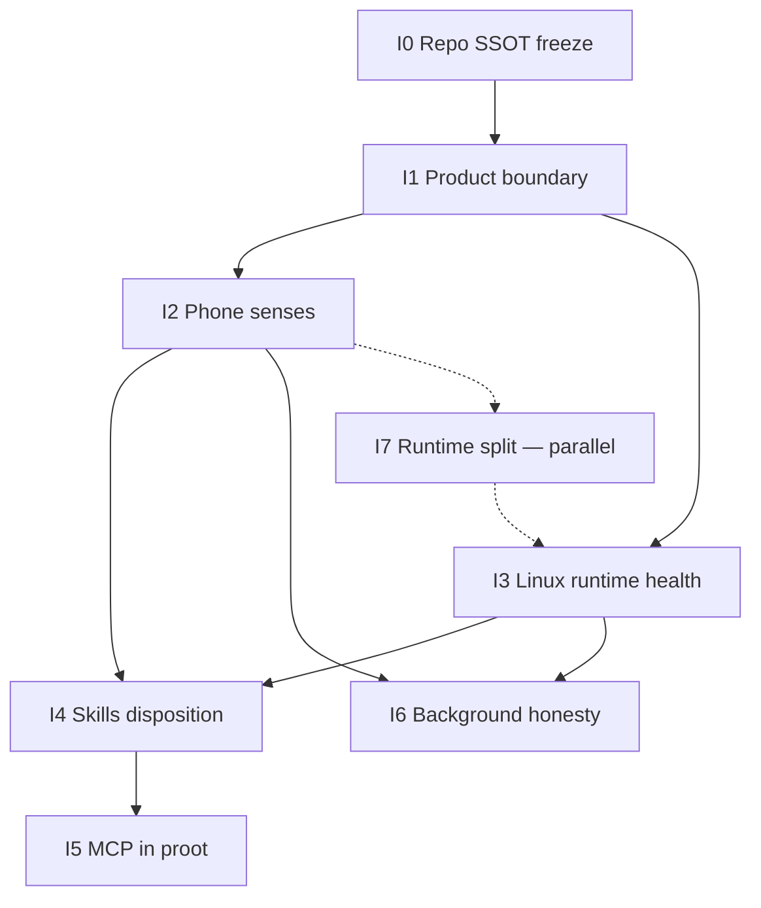

# ClawChat 后续迭代计划：口袋个人 Agent 机器

**Status:** Draft product SSOT for post-v2.8 work. This document is planning-only: none of the iterations below is implemented, tested, released, or approved by virtue of this file.

**Date:** 2026-09-15 (I0/worktree close-out and SAF holding-branch note: 2026-09-16)
**Applies to:** `/Users/lfxanka/Desktop/tool/ClawChat`
**Supersedes as product direction:** informal “pocket Linux vs Android assistant” debate. Does not replace the v2.6–v2.8 implementation SSOT at [`2026-07-15-v2.6-v2.8-agent-quality-results-background-plan.md`](2026-07-15-v2.6-v2.8-agent-quality-results-background-plan.md) for those already-specified versions.

**Implementation order (fixed):** I0 Repo/SSOT freeze → I1 Product boundary → I2 Phone senses → I3 Linux runtime health → I4 Skills disposition → I5 MCP in proot → I6 Background honesty. I7 is a parallel structural lane, not a sequential product version. Two ordered exceptions are recorded in Order authority below: **I3 may start after I1 without waiting for I2**, and **I6 depends on I2 + I3 without waiting for I5**.

A later product iteration may depend only on merged predecessors. No iteration is released merely because its branch is merged.

**Order authority (this paragraph wins if later sections disagree):**

1. I2 may start only after I1’s **settings IA code** has landed: 读取 vs 外发 as separate rows. README polish may lag. “Contracts written” means that settings code, not a markdown draft.
2. I7 is optional parallelism after I2’s first SMS/calendar slice exists on a branch. I2 must not wait for a full ChatProvider split. I7 must not ship as its own version ahead of I2.
3. First public cut is I0 + I1 + I2.sms-and-split-minimum. There is no I1-only release.
4. **I3 may start once I1 has landed; it does not wait for I2.** I2 and I3 may proceed in parallel. I4 still needs I2’s calendar/SMS overlap.
5. **I6 depends on I2 and I3; it does not wait for I5.**

---

## 1. Product thesis

ClawChat is a **pocket personal agent machine**.

- It has a local Linux userland: files, scripts, workspace, skills, and web fetch live here. This is the general-purpose hand.
- It is plugged into an Android phone: calendar, SMS, contacts, alarms, share, and opening apps are this machine’s private senses and actuators.
- Chat is the remote control, not a third world.
- It is not Cursor, not a system assistant, and not a pure Termux clone.

One-line filter for every later feature:

> General-purpose work runs in Linux. Private phone data and phone actions run through Android APIs. Chat drives both. It does not write engineering code, but it must be able to read my SMS and calendar.

### 1.1 What this is

| Surface | Job |
| --- | --- |
| Chat | Drive tools, show progress, ask for consent, recover interrupted work |
| Alpine / proot | Workspace, scripts, packages, imported skills, optional MCP hosts |
| Android APIs | Read calendar / SMS / contacts; local actions; gated outbound send |
| Terminal | First-class view of the Linux machine |
| Remote Agent | The bigger machine for long / always-on work |

### 1.2 What this is not

- A mobile IDE: no LSP, repo index, code completion, or IDE chrome.
- A resident system assistant: no boot-start model runs, notification listener, accessibility takeover, or silent outbound send.
- A cloud agent with a phone skin: local state stays authoritative; no mandatory account or hosted control plane.

### 1.3 Authorization posture that stays frozen

Existing `ToolPolicy`, `SkillCapabilityPolicy`, and per-call approval remain the only execution authority. New phone tools, skills, MCP, and background recovery compose with them. They do not create an alternative allow path.

Every new proposed action keeps this order:

1. Fresh `operationId`. IDs are never recycled.
2. Canonicalize and bounds-check without executing.
3. Global hard deny.
4. Skill capability deny when a skill context is active.
5. Approval: Ask / Auto Allow only where shared policy permits; recovery can demand a fresh approval.
6. Execute only after the preceding checks allow it. Persist a terminal receipt before UI claims a terminal outcome. If the boundary was crossed but a terminal receipt cannot be proved, persist `unknown_outcome`, do not retry automatically, and show recovery.

---

## 2. Repository truth at 2026-09-15

This section describes the checked working tree and adjacent worktrees as of 2026-09-15, **including dirty state**. **Superseded for SSOT and local state by §5 (I0 close-out) and §16:** local `main` is now `a452586` and the dirty tree is reset. The rows below are kept as the historical evidence I0 was checked against. Naming an SSOT SHA is not enough if uncommitted work can vanish on checkout.

**Shipped-state note (2026-09-16):** v2.6.0–v2.8.0 shipped per `CHANGELOG.md`; the July plan’s own status header is stale where it says those versions are unimplemented. The v2.6 skill evals are a repo/CI tool (`flutter_app/tool/skill_evals/`), not a runtime gate.

| Topic | Current checked fact | Evidence |
| --- | --- | --- |
| SSOT commit | `origin/main` = `a452586` (`fix: label legacy skills consistently`), pubspec `2.8.0+13` | `git rev-parse origin/main` |
| Local `main` HEAD (2026-09-15) | `32d7468`, ancestor of origin, behind 10 commits. The **committed** pubspec on that SHA is `2.5.2+8`; `2.5.3+9` was the **dirty worktree** value, not the commit. Reset to `a452586` on 2026-09-16 (§5) | `git show 32d7468:flutter_app/pubspec.yaml`; `git log` |
| Local dirty tree | 38 porcelain items; tracked diff vs HEAD is 22 files / +2432 / −738. Not a clean checkout of either SHA | `git status --porcelain` |
| Dirty vs origin | Some dirty files **equal origin** (`README.md`, `privacy-policy.html`, `build.gradle`, `AndroidManifest.xml`, `tool_call_card.dart`, `scripts/build-apk.sh`). Others equal **neither** HEAD nor origin, including `MainActivity.kt`, `chat_screen.dart`, `file_attachment_service.dart`, `native_bridge.dart`, `pubspec.yaml` (dirty pubspec still says `2.5.3+9` / `file_picker: ^8.0.0`) | `git hash-object` vs `origin/main:<path>` |
| Untracked | Includes this plan (`docs/plans/`), plus files that already exist byte-identical on origin (`RELEASE_SIGNING.md`, `release/`, `scripts/verify-release-signer.py`, `scripts/test_verify_release_signer.py`), round launcher icons, and junk `flutter_app/android/app/.cxx/` | `git status`; origin byte-compare 2026-09-15 |
| Tracked scripts already on origin | `scripts/verify-proot-packaging.py` and `scripts/test_verify_proot_packaging.py` are byte-identical to origin (verified 2026-09-15). Not dirty. I0 must not treat them as unique hunks | `git hash-object` vs `origin/main:<path>` |
| Origin vs local HEAD | origin is the forward tree (+24932 / −1000 vs local HEAD). Local HEAD is not a fork with extra commits | `git diff HEAD origin/main --stat` |
| Agent loop | Dart `AgentService.runAgentLoop` + `LlmService` + `ToolRegistry` | `flutter_app/lib/services/agent_service.dart` |
| Linux machine | proot Alpine via Kotlin `ProcessManager`; bash default cwd `/root/workspace`; agent commands do not mount shared storage | `ProcessManager.kt`, `bash_tool.dart` |
| Phone API | One `phone_intent` tool covers 13 actions: `setAlarm`, `openWeb`, `dialPad`, `share`, `mapsNavigate`, `composeEmail`, `openCamera`, `addCalendarEventIntent`, `insertCalendarEvent`, `listCalendarEvents`, `listContacts`, `callPhone`, `sendSms`. **No SMS read.** The I2 split is a re-grouping of these existing actions, not new capability; SMS read is the only new one | `phone_intent_tool.dart:25-32`, `PhoneIntentManager.kt:64-330` |
| SMS | `SEND_SMS` exists; `READ_SMS` does not | `AndroidManifest.xml`, `PhoneIntentManager.kt` |
| Calendar read | `listCalendarEvents` returns id/title/begin/end/location/description; default window now→+7d; default limit 50 | `PhoneIntentManager.kt:213-248` |
| Contacts read | `listContacts` returns id/name/phones; default limit 50 | `PhoneIntentManager.kt:250-285` |
| Outbound gates | `callPhone` / `sendSms` default off in prefs; SMS send shows a confirmation dialog | `preferences_service.dart`, `PhoneIntentManager.kt:310-364` |
| Skills | Nine bundled presets are `SKILL.md` only, installed disabled. The **code gate** is legacy consent whose grant stays current only while `manifestDigest`, `contentDigest`, `version`, and `legacy` match (`skill_service.dart:594-615`: `enabled: storedEnabled && consentCurrent`). There is **no** `evaluable` / host-evaluable flag in `lib/`. “Locked until host-evaluable behavior” is v2.6 plan language that never shipped as a gate. I4 uses the existing consent digest gate, not the removal of a fictional evaluable lock | `skill_service.dart`, `SkillConsentDialog`; contrast `docs/plans/2026-07-15-…-plan.md` |
| Calendar skill | Bundled `gws-calendar` teaches `curl` against Google Calendar with `GOOGLE_ACCESS_TOKEN`, not Android CalendarContract | `assets/skills/gws-calendar/SKILL.md` |
| MCP | Settings can save stdio servers; Android explicitly does not start them | `mcp_service.dart:163-169` |
| Background | `AgentTaskService` special-use FGS, overlay Dynamic Island, wakelock, `RECEIVE_BOOT_COMPLETED` declared but v2.8 forbids boot resume. **The permission itself is retained, not unused — owner is the persisted cleanup job (§3.0)** | `AgentTaskService.kt`, `AndroidManifest.xml`, v2.8 plan |
| God object | `chat_provider.dart` **6881 lines on dirty local `ClawChat/` (`32d7468` + uncommitted)**; **7798 lines on SSOT `origin/main` `a452586`**. Feature work uses 7798. Do not cite 6881 as the baseline. | `wc -l` on each tree |
| Default prompt | Still “helpful AI assistant” with shell/files/web; does not mention phone data | `constants.dart:35-38` |
| Settings copy | “手机集成” describes `phone_intent` and only extra-gates call/SMS send | `app_strings.dart:473-481` |

---

## 3. Global boundaries for all later iterations

### 3.0 Distribution gate (answers before I1)

**Play Store is not a goal for the next two versions.** Distribution remains APK / sideload. I1 permission audit uses that posture:

- Do not keep a permission *because Play requires a story for it*.
- Do remove permissions that this product does not use, even on sideload (`MANAGE_EXTERNAL_STORAGE` unless a documented SAF-insufficient maintenance flow exists). **Keep `RECEIVE_BOOT_COMPLETED`: a non-execution use exists.** Owner scenario: the persisted cleanup job (`CommandCleanupCoordinator.kt:2349` `.setPersisted(true)` on `CommandCleanupJobService`) requires it to survive reboot, and there is no boot `<receiver>`. It must never start a model or tool run. Do not pair it with `MANAGE_EXTERNAL_STORAGE` on one removal line.
- `READ_SMS` may ship in the sideload APK in I2. If Play is later adopted, SMS read moves to a non-Play flavor or is withdrawn; that is a new decision, not I2 scope.
- `FOREGROUND_SERVICE_SPECIAL_USE`, `REQUEST_INSTALL_PACKAGES`, and `SYSTEM_ALERT_WINDOW` stay allowed on sideload; I6 still demotes overlay off the default path.

### 3.1 Non-goals

- No required account, cloud backup/sync, hosted control plane, remote policy authority, or **ClawChat-operated** telemetry / analytics / crash pipeline.
- No silent upload of prompts, tool I/O, SMS/calendar bodies, secrets, or receipts to any ClawChat service. ClawChat does not operate such a service.
- **User-configured model providers are an explicit send.** When the user has configured Claude / OpenAI-compatible / DeepSeek / etc. and sends a chat turn, selected conversation context, tool schemas, and tool results (including bounded SMS/calendar payloads from I2) may leave the device to that provider. This is the same contract as today’s privacy policy §3. I2 does **not** require an on-device model.
- Diagnostics exports stay local, metadata-oriented, and never automatic. Secrets stay out of traces.
- No engineering-coding product: LSP, repo index, code completion, IDE layout, or “write my app” as a north star.
- No return to OpenClaw / Ubuntu / Node gateway as the on-device runtime.
- No boot receiver, JobScheduler, or alarm that starts a model/tool run. `CommandCleanupJobService` stays cleanup-only.
- No notification listener, call recording, accessibility takeover, SMS broadcast inbox watcher, or contacts write.
- No silent outbound SMS/call. Direct send stays default-off and confirm-on-use.
- A passing skill eval, import inspection, or recovered task record never grants permission.

### 3.2 Permission rule

| Class | Rule |
| --- | --- |
| Read phone data | Requested at first use of that tool, with in-app explanation. Not at install. Default tool enabled in registry, but OS permission may be missing until the user grants it. |
| Local write / open UI | Prefer system UI (`addCalendarEventIntent`, share sheet, dialer) over silent writes. Silent writes keep Ask. |
| Outbound | Separate settings, default off, per-call or per-session confirmation. Read access never implies send access. |
| Storage | Agent bash does not mount `/storage`. User-picked files go through SAF. `MANAGE_EXTERNAL_STORAGE` is not a product default; I1 removes it unless a documented, user-initiated maintenance flow still needs it. |
| Overlay / boot | Overlay is not the primary status surface. Boot permission is not authorization to resume work. |

### 3.3 Isolation and ownership

1. SSOT is `origin/main` at `a452586`. Feature branches start there. Local `ClawChat/` `main` at `32d7468` is a dirty, behind checkout — not a baseline.
2. Each iteration starts from its approved predecessor on a dedicated branch. Names below may change only if the release owner records the replacement.
3. An iteration must not stage, clean, reset, revert, or format unrelated files.
4. Release lane owns version number, `CHANGELOG.md`, artifact, and signing evidence after that iteration’s Definition of Done. It does not opportunistically repair feature code.
5. Review lanes are read-only: `PASS` / `PARTIAL` / `BLOCKED` / `FAIL` with commands and file:line evidence.

---

## 4. Iteration map

| ID | Name | Ships | Depends on |
| --- | --- | --- | --- |
| I0 | Repo SSOT freeze — **closed 2026-09-16 except the still-uncommitted plan** (§5) | Named SHA, dirty-tree disposition, worktree keep/archive | — |
| I1 | Product boundary | Frozen thesis, copy, settings IA **code**, prompt, sideload permission audit | I0 |
| I2 | Phone senses | Split phone tools, SMS read, tighter calendar/contacts read, untrusted-data gate | I1 settings IA code |
| I3 | Linux runtime health | Machine status, command lifecycle, no default whole-disk bind, **no durable daemon**; **review + device-verify parked SAF picker (`fix/android-saf-picker`)** | I1 (may run in parallel with I2) |
| I4 | Skills disposition | Calendar → Android tools; Gmail/Drive stay as bundled power-user presets with **legacy consent + 自备 token** copy | I2 for calendar/SMS overlap |
| I5 | MCP in proot | Run-scoped Alpine stdio MCP + §7.7 untrusted results + env allowlist | I3 |
| I6 | Background honesty | FGS for the current run only; overlay in Developer Mode; boot unused for agent runs | I2 + I3 (does not wait for I5) |
| I7 | Runtime split (parallel) | Session / Run / ToolAttempt / Machine process lease | May start after I2’s first slice exists; must not block I2 |

Suggested public version mapping:

| Public version | Iteration payload |
| --- | --- |
| 2.9.0 | I0 + I1 + I2.sms-and-split-minimum |
| 2.10.0 | I3 runtime health + SAF picker review/device evidence |
| 2.11.0 | I4 skills |
| 2.12.0 | I5 MCP in proot |
| 2.13.0 | I6 background honesty |
| (no dedicated version) | I7 lands piecewise on I2–I6 branches; not a product train |

**Version bump rule (release lane, per §3.3.4):** the release lane raises `flutter_app/pubspec.yaml` to the §4 version with a **strictly increasing build number** `+N`; `flutter_app/android/app/build.gradle:14-17` derives `versionName`/`versionCode` from pubspec and rejects a missing `X.Y.Z+N`. `2.9.0` must carry a build number **greater than `2.8.0+13`**, and the release lane verifies `versionCode` increased (Android rejects a same-lineage update with a lower `versionCode`; see `RELEASE_SIGNING.md`). 2.9.0 acceptance is the `[2.9.0]`-tagged §7.7 set.

---

## 5. I0 — Repo SSOT freeze

**Goal:** Stop doing every feature twice, and do not lose uncommitted work on a `git checkout` / `git clean`.

**Decided:**

- SSOT SHA is `origin/main` = `a452586`.
- Feature work starts from a clean checkout of that SHA. Local `32d7468` + 38 dirty items is not a development baseline.
- **Closed 2026-09-16:** extra worktrees removed. The only remaining checkout is `ClawChat/` on `main` @ `a452586`. Unverified SAF work is parked on local branch `fix/android-saf-picker` (`dd9425d`), **not** merged to `main` / origin. See §8.7.

**Work:**

1. **Salvage the dirty `ClawChat/` tree before any clean/reset.** 38 porcelain items. Classification as of 2026-09-15:
   - **Already equal to origin, keep by checking out SSOT:** `README.md`, `docs/privacy-policy.html`, `flutter_app/android/app/build.gradle`, `AndroidManifest.xml`, `tool_call_card.dart`, `scripts/build-apk.sh`, **`scripts/verify-proot-packaging.py`**, **`scripts/test_verify_proot_packaging.py`** (last two tracked, byte-identical, not dirty; do not port).
   - **Untracked product/docs to copy onto the SSOT tree then commit in the proper lane:** this plan (`docs/plans/2026-09-15-pocket-agent-machine-iteration-plan.md`); do not lose it.
   - **Untracked, byte-identical to origin, discard (verified 2026-09-15, do not copy):** `RELEASE_SIGNING.md`, `release/`, `scripts/verify-release-signer.py`, `scripts/test_verify_release_signer.py`.
   - **Untracked junk, discard:** `flutter_app/android/app/.cxx/`.
   - **Neither HEAD nor origin nor xd-skill HEAD:** `MainActivity.kt`, `chat_screen.dart`, `file_attachment_service.dart`, `native_bridge.dart`, `settings_screen.dart`, related tests, dirty `pubspec.yaml` (still `2.5.3+9`). Treat as a **manual salvage patch**, not “someone rewound origin into the old tree.” Likely a partial, conflicted backport of SAF / UI work onto `2.5.3`. Diff against `ClawChat-wt-xd-skill` (`dd9425d`) and origin; keep only unique hunks, or discard if they are worse than xd-skill.
   - Round launcher icons / `drawable-nodpi`: keep if origin does not already have the same assets; otherwise discard duplicates.
2. **Worktrees (verified 2026-09-15, dirty=0 and HEAD ancestor of origin unless noted):**
   - Archive: `ClawChat-wt-dev1` (`0f4043c`), `ClawChat-wt-dev2` (`5da92c4`), `ClawChat-wt-release-917077e` (`917077e`), `ClawChat-wt-v2.6-evals` (`da6fd74`), `ClawChat-wt-v2.6-ui` (`2f332fc`).
   - Archive: `ClawChat-wt-integration` (`b9860f3`). Four commits not in origin are merge commits of work already on origin; tree vs origin is a stale subset. Do not mine it for features.
   - **Do not merge to `main` until I3 device evidence:** the three SAF commits that lived on `ClawChat-wt-xd-skill` (`c8c96ef`, `d4c9402`, `dd9425d`; +1579/−50). Parked 2026-09-16 on `fix/android-saf-picker`. Name was misleading: this is Android SAF file picking, not xd-skill discovery (`1010fee` is already on origin).
3. After salvage, all I1+ branches start from `a452586`. Do not start them from `dd9425d`.
4. Fill §16 when I0 closes.

**Done when (updated 2026-09-16):**

- SSOT SHA `a452586` is recorded in §16. Local `main` matches it.
- **This plan is committed on `main` under `docs/plans/`.** I0 is **not** fully closed until that commit exists; until then the roadmap survives only in `ClawChat-salvage-2026-09-16/`, and a `git clean` would delete it.
- Extra worktrees are gone (dev1/dev2/integration/release-917077e/v2.6-evals/v2.6-ui/xd-skill).
- Dirty `32d7468` tree was reset; unique bits live in `ClawChat-salvage-2026-09-16/` if still needed.
- SAF commits are on `fix/android-saf-picker`, not on `main`.
- Feature work on dirty `32d7468` is forbidden.

**Out of scope:** rewriting git history; deleting worktrees before salvage.

---

## 6. I1 — Product boundary in the product

**Goal:** Make the thesis visible so later features stop drifting.

**Distribution input:** §3.0 — sideload only for the next two versions.

**Work:**

1. Add a short `PRODUCT.md` (or a top section in `ARCHITECTURE.md`) with the thesis, the two runtimes, and the non-goals in §3.1. Privacy language must match §3.1: no ClawChat telemetry; user-configured providers receive context the user sent.
2. Rewrite user-facing copy:
   - README feature list: Linux workspace **and** phone data/actions. Stop advertising “9 preset skills” unless I4 has re-enabled them.
   - Settings: rename “手机集成” to “手机数据与动作”. Separate **读取** (calendar, SMS, contacts) from **外发** (call, SMS send). This settings split is the I2 start gate. **Do not re-key storage:** the existing `allow_phone_call` / `allow_sms` preference keys (`preferences_service.dart:96-97`) keep their names so an upgrade preserves an existing grant. I1 adds rows; it does not rename or migrate keys.
   - `AppConstants.defaultSystemPrompt` in I1 only: Alpine-hosted machine, not a generic phone assistant; do **not** name `phone_read` / `phone_send` until those tools exist in I2. I1 may say the user can grant phone data/actions later; it must not advertise tools that are not in the registry.
3. Permission audit under sideload posture:
   - `RECEIVE_BOOT_COMPLETED`: **keep.** A non-execution use exists: the persisted cleanup job (`CommandCleanupCoordinator.kt:2349` `.setPersisted(true)` on `CommandCleanupJobService`) needs it to survive reboot. It must not resume agent runs. Record this owner scenario instead of removing the permission.
   - `MANAGE_EXTERNAL_STORAGE`: remove from default path unless a documented, user-initiated maintenance flow needs it. Agent file import uses SAF.
   - `SYSTEM_ALERT_WINDOW`: optional, not required for core status (see I6). Do not prompt during onboarding.
   - `CALL_PHONE` / `SEND_SMS` stay in the manifest but are unused until the matching setting is on **and** OS permission is granted. `READ_SMS` is added in I2, not I1.
   - `REQUEST_INSTALL_PACKAGES` and `FOREGROUND_SERVICE_SPECIAL_USE` stay for sideload; document why.
4. Chat empty state: commands, workspace files, and existing phone actions — not “AI 助手可以执行命令” alone. Do not claim SMS read until I2.

**Done when:**

- A new contributor can read one page and know Linux vs Android vs non-goals.
- Settings UI **code** shows read vs outbound as different rows (this is the I2 gate).
- Default system prompt does not name tools that are not registered.
- Manifest permissions each have a written owner scenario, or they are removed.
- Privacy copy no longer implies “SMS never leaves the device” while chat uses a cloud model.

**Out of scope:** implementing SMS read (I2); moving overlay behind Developer Mode (I6).

---

## 7. I2 — Phone senses

**Goal:** Reading the phone is a first-class, bounded, consent-heavy capability. Outbound stays stricter than read.

### 7.1 Tool split

Replace the single `phone_intent` mega-tool as the model-facing API. Native `PhoneIntentManager` may remain the dispatcher during the migration, but the model must see separate tools. **This is a re-grouping of actions that already exist**, not new capability: every action below except `listSms` / `getSms` is already reachable through `phone_intent` today (`phone_intent_tool.dart:25-32`). Do not re-implement existing actions.

| New tool | Actions | Risk | Default in registry | OS permission | App setting |
| --- | --- | --- | --- | --- | --- |
| `phone_read` | `listCalendarEvents`, `listSms`, `getSms`, `listContacts` | moderate | yes | per action, at first use | none beyond OS grant |
| `phone_act` | `setAlarm`, `openWeb`, `dialPad`, `share`, `mapsNavigate`, `composeEmail`, `openCamera`, `addCalendarEventIntent`, `insertCalendarEvent` | moderate; `insertCalendarEvent` stays Ask | yes | write-calendar only for silent insert | none |
| `phone_send` | `callPhone`, `sendSms` | dangerous | registered but disabled until setting on | `CALL_PHONE` / `SEND_SMS` | `allowPhoneCall` / `allowSms`, default false |

Compatibility: keep `phone_intent` as a hidden alias for one release if needed, but new prompts and skills must not document it. The `phone_read` / `phone_act` / `phone_send` split moves existing actions between tools; only `listSms` and `getSms` add capability.

### 7.2 SMS read (new)

This is the user-named gap.

**Actions:**

- `listSms`
  - Filters: `threadId?`, `address?` (number), `query?` (body substring), `startMillis?`, `endMillis?`, `box?` (`inbox` \| `sent` \| `all`, default `inbox`)
  - `limit` default 20, max 50
  - Returns: `{ ok, messages: [{ id, threadId, address, displayName?, dateMillis, box, snippet }] }`
  - `snippet` is at most 280 characters. Full body is not in the list.
- `getSms`
  - Required: `id`
  - Returns one message with `body` capped at 4000 characters, plus the list fields.

**Rules:**

- Manifest adds `READ_SMS` only as a runtime permission used by these actions.
- First call triggers the system permission prompt plus a one-time in-app explanation: ClawChat does not operate a server; the **configured model provider** will receive this turn’s context, including SMS fields returned by the tool; SMS is not watched in the background.
- No `RECEIVE_SMS`, no `SMS_RECEIVED` broadcast, no full-inbox dump, no MMS media payload in v1.
- If permission is denied, return `permission_required` and a user-visible Fix action in chat — do not retry in a loop.
- `PrivacyFilter` (env-var masking) is **not** an injection boundary. SMS/calendar/contact payloads are tagged `untrusted` at the tool-result boundary (see §7.7).
- Do not log SMS bodies, addresses, or snippets.

**Distribution:** Sideload APK may include `READ_SMS`. Play is out of scope for this version (§3.0).

### 7.3 Calendar read (tighten existing)

Keep `listCalendarEvents`. Add:

- `query?` substring on title/description/location
- Default window: start of today local → +7 days, not “now → +7d” (that drops earlier-today events)
- Default `limit` 20, max 50
- Return `allDay` if available
- Times as both `beginMillis` and ISO-8601 local strings so the model does not guess timezone
- Never return a dedicated attendees list or conference-join fields in v1 unless a later iteration explicitly adds them with Ask
- **`description` is also untrusted and must be redacted in I2:** strip URLs (http/https/intent/meeting-join patterns, including Zoom/Meet/Teams), emails, and `tel:` values from `description` before the tool result is built. Do not claim “no conference URLs” while still returning raw `description`

`insertCalendarEvent` stays on `phone_act` and remains Ask. Prefer `addCalendarEventIntent` in the tool description for user-visible creates.

### 7.4 Contacts read (tighten existing)

Keep `listContacts`.

- Default `limit` 10, max 20 when `query` is missing; default 20, max 50 when `query` is present
- Empty `query` must not dump the whole address book; require `query` of at least 1 character **or** an explicit `limit <= 10`
- Return `name`, `phones` (max 3), optional `emails` (max 2) if cheap
- No contact write, no raw contact data blobs

### 7.5 Outbound (keep, isolate)

- `phone_send` is omitted from tool definitions unless the matching app setting is on.
- `sendSms` keeps the confirmation dialog and fails closed if the activity is not resumed (`canShowConfirmationDialog` already does this).
- `callPhone` keeps “open the dialer unless the dangerous setting is on”.
- Read tools never appear in the same settings row as send tools.

### 7.6 Chat / model contract

- System prompt lists phone read tools only as “available if the user has granted permission”. This prompt change lands in I2 with the tools, not in I1.
- Tool results use the existing result formatter; I2 does not require v2.7 rich cards, but must remain valid input to them.
- A denied OS permission is a tool error with a stable code, not a model hallucination opportunity.

### 7.7 Untrusted tool data (hard constraint)

This is the **I2/I5 host injection boundary for tagged tool data**. Prompt text does not satisfy it. `PrivacyFilter` (env-var masking) does not satisfy it. It is **not** a closed prompt-injection story for the whole app (see residual below).

**Sources that MUST be tagged `trust: untrusted` (or an equivalent agent-loop annotation) when they enter the conversation / tool-result stream:**

| Source | Lands in | Notes |
| --- | --- | --- |
| `phone_read` SMS snippet/body, address, displayName | I2 | External sender controls the bytes |
| `phone_read` calendar `title` / `location` / redacted `description` | I2 | Attendees and synced invites can inject text |
| `phone_read` contact `name` | I2 | |
| `web_fetch` / `web_search` result body (and titles/snippets returned to the model) | **I2** | Already in the registry. Same class as SMS: attacker-controlled remote text. Tag lands in I2. **Same-channel follow is Ask, not a silent allow** (see “Web→web follow” below). Cross-channel use of those URLs still hard-denies |
| MCP tool results (stdout / structured content) | **I5**, same plumbing as I2 | Third-party server text. I2 must land the annotation + deny engine so I5 can attach the same flag. I5 Done-when requires MCP results to carry it |

**Derived copies that MUST preserve the tag (cross-run / laundering):**

- Session history replay of an untrusted tool result (the next user turn in the same session).
- `memory_write` / `memory_get`: writing untrusted text into memory without the tag, then reading it back, is a **hard fail**. Memory entries sourced from untrusted tool data stay untrusted until the user explicitly edits or confirms the stored fact in an Ask card that shows the exact text.
- `write_file` of untrusted bytes into `/root/workspace` does not clear taint if a later `read_file` of that path is fed to the model in the same session. I2 minimum: if `read_file` path was written this session from an untrusted payload, the read is untrusted. Broader filesystem taint is out of I2.

Clearing taint requires a **user-typed** value in the triggering chat message, or an Ask card that displays the **exact** value and is confirmed.

**Same-run derived-action deny (host-side, `ToolPolicy.additionalDenyCheck` / agent loop):**

An untrusted payload in this run (including replayed untrusted history and untrusted memory hits used this run) must not be the sole trigger for:

- `phone_send` (`callPhone`, `sendSms`)
- `phone_act.openWeb`, `phone_act.share`, `phone_act.composeEmail`, `phone_act.mapsNavigate`, `phone_act.dialPad` (these leave the device or hand data to another app)
- `bash` network exfil to a destination not on a host allowlist. Do **not** implement this as a `curl`/`wget`/`nc` denylist plus an “equivalent” comment. I3’s baseline packages already include other networked programs. The I2 matcher must treat as network exfil at least: `curl`, `wget`, `nc`, **`busybox wget`**, **`python3` / `python` network APIs** (`urllib`, `http.client`, `requests`, …), **`git`** (`clone` / `fetch` / `push` / `ls-remote` against a remote). Unknown binaries that take a URL argument fail closed in I2 only when the URL/host matches the untrusted extracted set or substring bar; a full default-deny outbound firewall is **not** I2.
- `web_fetch` / `web_search` of a URL that came from **SMS / calendar / contacts / MCP** (always hard-deny unless user-typed or Ask-confirmed)
- `write_file` outside `/root/workspace`

`phone_act.setAlarm`, `openCamera`, and calendar UI insert are not in this deny list for I2 (they are local UI). `insertCalendarEvent` stays Ask on its own risk path.

**Web→web follow (decided, 2.9.0 ships this):**

Tagging `web_fetch`/`web_search` as untrusted would otherwise block ordinary “open the link on this page.” I2 does **not** silently allow that, and does **not** hard-deny it.

| From \ To | later `web_fetch` / `web_search` | `phone_act.openWeb` / `share` / `composeEmail` / `mapsNavigate` / `dialPad` | `phone_send` | `bash` network (`curl`/`wget`/`nc`/`python3`/`git`/`busybox wget`) |
| --- | --- | --- | --- | --- |
| `web_fetch` / `web_search` body | **Ask**, showing the exact URL | hard-deny unless user-typed / Ask-confirmed | hard-deny | hard-deny |
| SMS / calendar / contacts | hard-deny | hard-deny | hard-deny | hard-deny |
| MCP (I5) | hard-deny | hard-deny | hard-deny | hard-deny |

Ask for web→web: the card must show the full URL; Cancel / timeout fail-closed; Auto Allow does **not** apply. A user-typed URL in the triggering chat message still skips Ask (same clearing rule as the rest of §7.7).

This is a behavior change in 2.9.0 for the most-used tools: following a link found in a fetched page used to be silent; after I2 it requires Ask. Document it in the I2 changelog.

**Match bar (I2 ships this; “substring” is necessary but not sufficient):**

1. Hard-deny if a later tool call’s URL, phone number, email, or body **contains a substring** of an untrusted payload received this run (or replayed/untrusted-memory this run), unless user-typed or Ask-confirmed as above.
2. Also extract URLs, `tel:` / phone numbers, and emails from the untrusted payload (regex, after HTML/markdown stripping) and deny those exact values in later tool arguments. An SMS that says `go to evil.example` must block `openWeb` / `curl` even if the tool arg is `https://evil.example` and not a raw substring of the whole SMS.
3. Tests must include at least: raw substring; extracted URL that is not a raw substring of the full SMS; `phone_act.openWeb` from SMS; untrusted `web_fetch` body driving `phone_send` or `curl` (hard-deny); `web_fetch` body driving a second `web_fetch` of an extracted URL (**Ask**, not silent, not hard-deny); `python3`/`git`/`busybox wget` using an extracted host; `memory_write` then `memory_get` then `curl`; history replay of an untrusted SMS into a second user turn that tries `phone_send`.

**Closed in 2.9.0 (was reserved for post-2.9.0):**

- **One canonicalization layer** before every bash / phone / web match: percent-decoding, one base64 layer (an argument fed to `base64 -d` / `--decode`, or a single argument that decodes to a URL, host, email, or phone), and empty-string quote-splitting ("" / ''). Nested encodings and shell concatenation of *non-empty* fragments remain out.
- **Shortlink / redirect hops**: `web_fetch` keeps `followRedirects = false` and now checks each `Location` hop (up to the existing redirect cap) against the run taint set, hard-denying before the hop is requested. A web→web chain that is not otherwise tainted still goes through the existing Ask path for the first requested URL.
- **`node` / `nodejs` / `bun`** are a named deny class like python: denied when the command carries a tainted URL or host, and `-e` is denied outright when any tainted value is in the command. `node` is **not** installed into the Alpine baseline (§8) — this is a deny rule only.
- **Same-run file copies**: a `write_file` whose content matches the run taint set marks the normalized `/root/workspace` path tainted; a later `read_file` of that path returns `trust: untrusted`, records its original source, and re-seeds the same run taint set; a bash command that reads that path while carrying a tainted destination is hard-denied. The path set is in-memory for the run only, so a new run does not inherit file taint and nothing survives a restart.

**Known residual (not I2 DoD; do not read “I2 must implement all of” as “injection is closed”):**

- DNS rebinding is not detected; the matcher compares strings, not resolved addresses.
- IP literals are not equated with hostnames, and homograph / punycode domains are not normalized.
- There is no default-deny outbound firewall: an unknown binary with no tainted URL or host is allowed.
- `perl` / `eval` interpreter indirection beyond the named checks is not covered.

I5 does not invent a second engine. It attaches `trust: untrusted` to MCP tool results and reuses this deny list.

**Done when (I2 product + this boundary):**

Every bullet is tagged `[2.9.0]` (required for the first public cut, §14) or `[post-2.9.0]` (the named next slice — kept here, not dropped).

`[2.9.0]`

- User can ask “今天有什么会” and get today’s local calendar without Google token.
- User can ask “XX 最近给我发了什么短信” after granting `READ_SMS`, with bounded snippets, after an explanation that the configured model provider will see that context.
- User who never granted SMS still gets calendar/contacts.
- `callPhone` / `sendSms` remain impossible until their settings are on (default-off send unchanged).
- Tool split: `phone_read` / `phone_act` / `phone_send` are the model-facing tools; `phone_intent` is a hidden alias only.
- Tightened calendar/contacts reads: default windows, limit caps, empty-query rule, `description` URL/email/`tel:` redaction.
- SMS/calendar/contacts **and** `web_fetch`/`web_search` results carry `trust: untrusted` at the tool-result boundary, and the tag is **persisted with the transcript entry**; at run start the taint set is re-seeded from prior untrusted entries, so history replay is enforced in 2.9.0.
- A tainted destination also hard-denies `bash` `curl` / `wget` / `nc` when the destination matches the untrusted exact URL/host/email/phone set.
- A non-user-typed untrusted payload cannot drive `phone_send.callPhone` / `sendSms` or `phone_act.openWeb` / `share` / `composeEmail` / `mapsNavigate` / `dialPad`; **web→web follow is Ask** (exact URL), not silent and not hard-deny.
- Only the **triggering** user message clears taint; an older typed value does not clear a newer untrusted payload.
- Tool execution is **sequential**: `parallelTools: true` is rejected before any tool starts so a sibling call cannot race the taint set.
- A background `share_text_v1` payload is compared with untrusted values already in the session transcript; a match denies the task, and an unreadable transcript fails closed.
- A denied runtime permission returns the stable `permission_required` code, is requested at most once per activity lifetime, and offers a one-tap **打开权限设置** action in the chat tool card.
- Tests cover: permission missing, limit caps, empty query on contacts, SMS list vs get, send still blocked by default, activity-not-resumed SMS send fails closed, description redaction, untrusted SMS cannot drive `phone_send` or the listed `phone_act` sinks without user-typed or Ask-confirmed value, extracted-URL case, untrusted `web_fetch`/`web_search` body as a source, **web→web follow is Ask**, **`python3` / `git` / `busybox wget` against an extracted host**, and **`memory_write` → `memory_get` → `curl`**.

**Complete `bash` network-exfil matcher:** beyond `curl` / `wget` / `nc`, the matcher hard-denies `busybox wget`, `python3` / `python` using `urllib` / `http.client` / `requests`, `git` `clone` / `fetch` / `push` / `ls-remote` against a remote, and an unknown binary whose arguments carry a tainted URL or host. `node` is still not added and a full default-deny outbound firewall is not part of I2.

**Memory laundering is closed:** a `memory_write` of a value that arrived from untrusted tool data is stored as untrusted; a later `memory_get` re-seeds the run taint set with the original source, so a subsequent `curl` / `phone_send` of that value is hard-denied. The run taint set is also seeded from untrusted stored memories at run start, even when the session replays no tool result, and the system prompt lists those facts under a separate **Untrusted memories** heading. The flags live in encrypted app storage (`flutter_secure_storage` / EncryptedSharedPreferences, key `clawchat.memory_untrusted.v1`), not in a file the guest shell can rewrite: the pre-2.9.0 rootfs file and the interim `clawchat_state` plain file are imported once and deleted, and neither is read again. If the encrypted store cannot be read, every stored fact is treated as untrusted. The flag clears when the user deletes the fact in Settings (`MemoryService.confirmMemoryText` is the confirm API and is not exposed as a model tool), and an ordinary user-typed write stays trusted.

`[post-2.9.0] — next slice, must be implemented, not dropped`

- Derived-copy preservation beyond the same-session `write_file` → `read_file` rule and the memory rules above.
- **Not deferred (ships in 2.9.0):** history replay seeding, sequential-tool enforcement, triggering-message-only clearing, the background-share transcript check, the complete `bash` network matcher, and memory laundering.

**Out of scope:** notification listener; MMS; WhatsApp/WeChat; writing contacts. Google Calendar OAuth stays out of I2; I4 replaces the default calendar path with Android calendar tools. Bundled Gmail/Drive presets are kept (I4), not implemented as host tools here. Cross-restart filesystem taint stays out (same-run only). DNS rebinding, IP-literal versus hostname, homograph domains, and a full default-deny outbound firewall remain out of scope; nested encodings, non-empty shell concatenation, and `perl` / `eval` indirection are not covered.

---

## 8. I3 — Linux runtime as a personal script machine

**Goal:** Keep Alpine as the general-purpose hand, make it operable, stop treating it as an IDE.

**Work:**

1. **Machine health surface** — extend the existing System Health destination (`flutter_app/lib/screens/dashboard_screen.dart`; `SystemHealthSnapshot` at `dashboard_screen.dart:22-37`; destination string `app_strings.dart:172` `dashboard = '系统健康'`):
   - Alpine ready / missing / corrupted
   - **New field:** disk used by rootfs + workspace
   - **New field:** DNS (`resolv.conf`) status
   - **New field:** last command: running / exited / unknown
   - Actions: Retry check, Reinstall Alpine (the existing action is `app_strings.dart:269` `reinstallAlpine`; keep the destructive confirm)
   - `SystemHealthSnapshot` today carries only `runtime`, `runtimeDetail`, `updateState`, `updatesKnown`, `extensionCount`, `extensionsKnown`; the three new fields are this iteration’s model work.
2. **Command lifecycle in chat:**
   - A bash tool attempt shows: started, running, completed, cancelled, interrupted-unknown
   - Browser handoff continuation stays opt-in (`background_continuation`)
   - After process death, UI says the command did not finish; no silent retry
3. **Workspace boundary:**
   - Confirm agent bash does not bind `/storage` (already documented in `BashTool`; add a regression test and health copy)
   - File attach / import stays SAF. **Do not silently take `fix/android-saf-picker` as done.** That branch is unverified; I3 must review and device-test it (§8.7) before it is the product path.
   - Remove or quarantine any path that re-enables whole-disk bind for agent commands
4. **Package / script reality:**
   - Document the intended packages (busybox, python3, git, curl, jq) as the personal-script baseline
   - Do not add Node, language servers, or a second runtime manager
5. **Dangerous bash:** keep deny patterns as defense-in-depth; Ask remains the real control for `ToolRisk.dangerous`
6. **No durable machine process in I3.** I3 tracks user-started commands tied to an agent run or an explicit one-shot terminal/bash. It does **not** introduce a long-lived daemon, MCP supervisor, or extra FGS owner. I5 v1 is run-scoped only (see §10).
7. **Parked Android SAF picker — review, do not rewrite.** Details in §8.7 **after** I3’s own Done-when (do not treat the SAF slice as I3’s whole bar).

**Done when (I3):**

- A user can tell whether the Linux machine is healthy without opening a raw terminal.
- Chat distinguishes “command still running” from “app was killed mid-command”.
- Automated test fails if agent command flags gain `/storage` bind by default.
- No I3 API or UI claims a durable server that outlives the agent run / FGS lease.
- SAF picker either merged after §8.7 review+device evidence, or explicitly deferred with a new owner decision (default is: ship in 2.10.0 after evidence).

**Out of scope (I3):** MCP bridge (I5); overlay Developer Mode move (I6); ChatProvider split (I7); always-on proot daemons; rewriting the SAF picker from scratch.

### 8.7 Unverified SAF picker (`fix/android-saf-picker`)

This subsection is an I3 work item, not a replacement for the I3 Done-when above.

**Judgement:** **code review + physical-device verification of the existing commits. Do not rewrite.** The implementation already has a host-owned `ACTION_OPEN_DOCUMENT` path, MIME fallbacks, persistable-grant-before-channel, 50 MiB cap, and JVM/Dart tests. What it lacks is device evidence.

**Checklist location:** `docs/release/2026-07-16-saf-file-picker-release-candidate.md` exists **only on `fix/android-saf-picker`** (added in `c8c96ef`). It is **not** on `origin/main` / local `main` (`a452586`); `docs/release/` is absent there. Reviewers working on `main` must check out or `git show fix/android-saf-picker:docs/release/2026-07-16-saf-file-picker-release-candidate.md`. Status on that branch is `NOT RUN ON A DEVICE`. Rewriting would throw away the OEM-specific fallbacks this work exists to keep.

**What it is (not xd-skill discovery):**

| Commit | Title | User-visible job |
| --- | --- | --- |
| `c8c96ef` | harden Android SAF file selection | Chat attach, settings JSON import, recovery JSON import, local skill archive pick go through App `OPEN_DOCUMENT` instead of `file_picker` on Android |
| `d4c9402` | add Android picker resolver fallback | If generic `*/*` has no `OPEN_DOCUMENT` resolver (Honor-class OEM): retry `application/octet-stream`, then `GET_CONTENT` without persistable grant |
| `dd9425d` | persist SAF grants before picker handoff | Take read-only persistable URI permission in the activity result **before** metadata crosses the method channel, so later copy does not lose the grant |

**Why it is not on `main`:** merging it without a device run would ship an unproven file-entry path. Local `main` was reset to `a452586` on 2026-09-16. The three commits remain on `fix/android-saf-picker` (`dd9425d`).

**I3 work on this slice:**

1. Review the three commits against origin `a452586` (permission boundary, `GET_CONTENT` must not persist, errors must not leak `content://` or cache paths, 50 MiB fail-closed, JSON/skill MIME vs `*/*`).
2. Fix only defects found in that review. No second picker architecture unless review proves the current one cannot work on Android 10+.
3. On `fix/android-saf-picker`, run the device checklist in `docs/release/2026-07-16-saf-file-picker-release-candidate.md` on a physical Android 10+ phone **with all-files access disabled**. Honor (or equivalent OEM with no `*/*` OPEN_DOCUMENT resolver) is required for the fallback path. Fill that file on the branch; `NOT RUN` is a fail.
4. Only then merge `fix/android-saf-picker` into the I3 release lane. Rebase onto current `main` if I1/I2 landed first.
5. This still does **not** remove `MANAGE_EXTERNAL_STORAGE`. I1’s permission audit remains a separate decision.

**Done when (SAF slice only):**

- Review notes recorded (PASS / defects-fixed).
- Device record in the 2026-07-16 release-candidate doc **on `fix/android-saf-picker`** is no longer `NOT RUN`.
- Attach / config import / recovery import / skill archive work with all-files access off; cancel is silent; >50 MiB leaves no partial file.

**Out of scope for this slice:** rewriting the picker; Play-store storage policy; making SAF the excuse to keep whole-disk bind for agent bash.

---

## 9. I4 — Skills disposition

**Goal:** Skills are files and scripts on this machine, plus host tools when the advertised behavior is actually an Android API. Stop shipping locked presets as if they were product.

Each bundled preset gets exactly one fate:

| Preset | Fate | Reason |
| --- | --- | --- |
| `gws-calendar` | **Default path becomes Android `phone_read` calendar.** Keep the Google-token curl skill in the bundle as an optional power-user preset, labeled Google Calendar API, not the phone calendar | “今天有什么会” uses the phone; Google stays for people with a token |
| `gws-gmail` | **Keep as bundled power-user preset** | Owner decision 2026-09-15. Unlock gate is the existing **legacy skill consent dialog** (`SkillConsentDialog` + `consentCurrent`), not host-evaluable curl. No in-app OAuth; user must paste their own `GOOGLE_ACCESS_TOKEN` into app env vars. Not an Android Gmail host tool. Tool Ask still applies to bash. |
| `gws-drive` | **Keep as bundled power-user preset** | Same gate and token story as Gmail |
| `github` | **Example** in workspace/docs, not a locked in-app skill | curl+token is a script; not a phone sense |
| `web-search` | **Keep only if `web_search` tool is the real path**; otherwise example | Host already has `WebSearchTool` |
| `file-manager` | **Keep only if it describes workspace + SAF**; rewrite away from whole-device storage | Align with I3 |
| `system-info` | **Rewrite against Machine health (I3)** or remove | `uname` in proot is not phone state |
| `translator` | **Example** | Prompt-only; no extra runtime |
| `code-review` | **Remove from app bundle** | Conflicts with “not an engineering coding product” |

Rules after disposition:

- App-managed skills and `xd-skill` CLI-managed skills stay visually distinct. Duplicate enabled IDs stay rejected.
- Import inspection, size caps, consent, and non-authorizing evals stay. A skill markdown cannot grant `phone_send` or bypass Ask.
- **Concrete unlock gate for Gmail/Drive (and optional Google-calendar preset):** they stay `legacy: true` SKILL.md bundles. They stay **disabled** until `SkillConsentDialog` records a current consent grant (`consentCurrent == true`), same path as today’s `_setSkillEnabled` / scan (`skill_service.dart`). I4 does **not** add a new `SkillCapabilityPolicy` bypass and does **not** require host-evaluable curl. Consent still does not approve individual bash/tool calls.
- Settings rows for these three must show, in user-visible copy: they call **Google APIs**, not Android Gmail/Drive/Calendar; **there is no in-app OAuth**; the user must **supply their own token** in environment variables (`GOOGLE_ACCESS_TOKEN`) before the skill can work.
- README may list Gmail/Drive as optional token skills. It must not list them as the way to read the phone inbox or phone files.
- Asking about the phone calendar must not require enabling `gws-calendar`.

**Done when:**

- Settings does not show nine locked legacy tiles as the product’s skill story.
- Asking about today’s phone calendar does not require `GOOGLE_ACCESS_TOKEN`.
- `gws-gmail` and `gws-drive` are still in the APK; a test can enable them only after a recorded legacy consent grant, and settings/README state “需自备 token / 无应用内 OAuth”.
- `code-review` is not installed by default.

**Out of scope:** building a skill marketplace; remote eval runners; Android Gmail/Drive ContentProvider integration.

---

## 10. I5 — MCP in proot

**Goal:** MCP stdio servers actually run on this machine. Hide-or-ship is closed: **ship**.

**Decided (2026-09-15):** persistent stdio MCP inside Alpine.

**Work:**

- Replace `McpPlatformSupport.isStdioSupported == false` on Android with a proot stdio bridge.
- **I5 v1 is run-scoped only.** An MCP child starts with the agent run that needs its tools and is killed when that run ends, is cancelled, or the FGS lease drops. There is no durable MCP supervisor in I3/I5. A later iteration may add always-on servers; it needs its own FGS owner and is out of I5.
- Timeouts, cwd under workspace. The MCP child does not inherit Android permissions (`READ_SMS`, contacts, etc.).
- **Env is an allowlist, not inheritance.**
  1. App / skill secrets such as `GOOGLE_ACCESS_TOKEN` are **not** copied into the MCP child.
  2. The child environment is only keys the user typed on **that** `McpServerConfig.env` (`mcp_server_config.dart`), plus a fixed non-secret guest baseline (HOME, PATH, LANG, TMPDIR).
  3. Docs, settings copy, and this plan must **not** tell users to point Gmail/Drive token skills at MCP or to paste Google tokens into MCP env. Gmail/Drive stay bash+env-var skills (I4). MCP is a separate connector.
- Target servers: user-chosen stdio binaries in Alpine that are not `phone_read`.
- Non-target: arbitrary `npx` as the onboarding default; using MCP to reimplement `phone_read`; treating MCP as the Google token runtime.
- Settings stay visible on Android and only list servers that the bridge can start. A failed start is a visible error, not an empty tool list.
- **Untrusted data:** every MCP tool result is tagged `trust: untrusted` and enters the §7.7 deny engine. No second policy.

Do not leave the current state: settings editable, stdio unsupported, silent empty tool list.

**Done when:**

- A documented on-device smoke test starts a pinned stdio MCP server in Alpine **for one agent run**, lists at least one tool, executes it, and the child is gone when the run ends.
- `McpPlatformSupport.isStdioSupported` is true on Android when proot is ready.
- MCP tool results carry `trust: untrusted` and are denied from driving `phone_send` / `phone_act.openWeb` / `curl` without user-typed or Ask-confirmed values (reuse I2 tests with an MCP stub).
- Unit tests cover: proot not ready, server crash, timeout, **guest env does not contain `GOOGLE_ACCESS_TOKEN` or other app env-var secrets unless that exact key was in `McpServerConfig.env`**, child dies with the run.
- Settings/docs do not suggest wiring Gmail/Drive tokens through MCP.

---

## 11. I6 — Background honesty

**Goal:** The machine may finish the run the user just started. It does not live in the status bar as a system assistant.

**Keep:**

- Foreground service for a user-started agent run
- Notification with session title, coarse status (thinking / tool / waiting for you), Stop
- v2.8 durable receipts, `unknown_outcome`, no automatic resume after process death or reboot
- Remote Agent as the place for long / always-on work

**Change:**

- **Decided (2026-09-15):** keep Dynamic Island code; move it behind Developer Mode. Default off. Do not delete it.
- Core path is notification-only. Do not prompt `SYSTEM_ALERT_WINDOW` during normal onboarding or the first agent run.
- Overlay permission is requested only after Developer Mode is on **and** the user enables “灵动岛 / 悬浮状态”.
- Notification copy talks like a machine (“正在读取日历”, “命令仍在运行”).
- `RECEIVE_BOOT_COMPLETED` is not used for agent resume. It **stays** (owner: the persisted `CommandCleanupJobService`); I1 records that scenario and does not remove it. It must never start a model or tool run.
- Multi-session parallel stays, but I6 first proves **one** run can be described correctly after kill. Do not add more overlay carousel work on the default path.

**Done when:**

- Default install never asks for overlay permission.
- Developer Mode + explicit overlay toggle is the only way to show the island.
- Killing the app leaves a recoverable receipt, not a silent restart.
- Stop on the notification cancels only that session (existing behavior, regression-tested).

**Out of scope:** rewriting FGS type for a future Play listing. Play is not a goal for the next two versions (§3.0). If that changes, I6 is revisited as a new decision.

---

## 12. I7 — Runtime split

**Goal:** New phone/runtime work stops accumulating in `ChatProvider`.

Extract, without changing product behavior:

| Object | Owns |
| --- | --- |
| Session | Messages, title, model, drafts |
| Run | One user-started agent loop, cancellation, partial text |
| ToolAttempt | operationId, policy, receipt, unknown outcome |
| Machine / Command | proot process lease, continuation, cleanup |
| PhoneTools | the I2 tool facades |

`ChatProvider` becomes a facade that maps UI intents onto those objects.

**Done when:**

- SMS read / command lifecycle / FGS start-stop do not add net new policy code to `chat_provider.dart`
- `chat_provider.dart` is no longer the only place that knows whether a run is alive
- Existing chat, cancel, and multi-session tests still pass

**Constraint (authoritative):** I7 is a parallel lane. It may start once I2’s first SMS/calendar slice exists on a branch. I2 must not wait for I7. If I2 must touch `ChatProvider`, add a thin `PhoneToolGateway` rather than more inline permission branches. I7 does not get its own release before I2.

---

## 13. Cross-cutting quality bar

Every iteration:

- Keeps local-first: no ClawChat-operated upload or telemetry. User-configured providers may receive the current turn, including I2 phone-read payloads, under §3.1.
- Adds tests at the policy boundary (default-off send, limit caps, permission missing).
- Treats background/foreground, process death, and missing OS permission as required review scenarios (`CLAUDE.md` red line 2).
- Does not install to a real device from agent automation (`CLAUDE.md` red line 1).
- Does not weaken hard-deny-before-approval.
- Updates `CHANGELOG.md` only in the release lane after DoD.

Device QA for I2/I3 is mandatory on at least one physical Android 10+ phone, because calendar/SMS permissions and FGS behavior are not fully substitutable by JVM tests.

---

## 14. First shippable cut (authoritative)

Ship **2.9.0 = I0 + I1 + I2.sms-and-split-minimum**. There is no I1-only release.

1. I0: salvage dirty tree, archive extra worktrees, develop from `a452586`. Do **not** merge `fix/android-saf-picker` here.
2. I1: settings 读取 vs 外发 (code); PRODUCT.md / README thesis; sideload permission audit. Prompt does not name I2 tools yet.
3. I2: `phone_read.listSms` + tightened `listCalendarEvents` + untrusted-data gate (SMS/calendar/contacts **and** existing `web_fetch`/`web_search` results) + description redaction + **web→web follow = Ask**. System prompt updated **here**.
4. `phone_intent` remains a deprecated alias for one version.
5. Do not wait for I5 MCP, I6 overlay-to-developer-mode, or a full ChatProvider rewrite.
6. Release lane bumps `flutter_app/pubspec.yaml` to the §4 version with a **strictly increasing build number** `+N`: `2.9.0` must be greater than `2.8.0+13`, and the lane verifies `versionCode` increased (`build.gradle:14-17` derives both from pubspec; Android rejects a lower `versionCode` on the same signing lineage — see `RELEASE_SIGNING.md`). 2.9.0 acceptance is the `[2.9.0]`-tagged §7.7 set.

---

## 15. Closed product decisions

Do not re-open in feature PRs:

1. Play Store in the next two versions: **no**. Sideload / APK only. SMS read may ship. (§3.0)
2. SSOT: **`origin/main` `a452586`**. I0 is **closed 2026-09-16 except that this plan is not yet committed**; the dirty `32d7468` work was salvaged item-by-item, not discarded by naming the SHA.
3. §3.1 “no upload”: **no ClawChat service / no telemetry**. User-configured model providers receive the turn, including bounded phone-read payloads.
4. Untrusted-data hard constraint: **yes** for SMS/calendar/contacts **and** `web_fetch`/`web_search` bodies (§7.7). Web→web follow is **Ask** (card shows the exact URL). `web_fetch`/`web_search` of a value from SMS/calendar/contacts/MCP is **hard-deny**. Web→`phone_send` is **hard-deny**. Web→`phone_act.openWeb` / `share` / `composeEmail` / `mapsNavigate` / `dialPad` is **hard-deny unless** the user typed that value or confirmed an Ask card showing the exact value. `web→bash` (`curl`/`wget`/`nc`) is **hard-deny** on a tainted destination. **§7.7 wins over this sentence's shorter form.**
5. Former `ClawChat-wt-xd-skill` SAF commits (+1579): **not merged**. Parked on `fix/android-saf-picker`. **Review + device-verify in I3; do not rewrite.** Not xd-skill discovery.
6. I5 MCP: **ship in proot, run-scoped v1**. Not hide. Not a durable daemon. Results are §7.7 untrusted. Secrets are not inherited.
7. Overlay: **keep, Developer Mode only**, default off. Do not delete.
8. Bundled Gmail/Drive: **keep in the APK**. Unlock = existing `SkillConsentDialog` / `consentCurrent`. Copy must say 需自备 token / 无应用内 OAuth. Phone calendar still goes through I2 Android tools. Do not route tokens through MCP.

I2 calendar/SMS may proceed after I0+I1 gates. I4/I5/I6 implement the decisions above; they do not re-litigate them.

---

## 16. Evidence appendix

| Field | Value |
| --- | --- |
| SSOT SHA | `a452586` (`origin/main`); local `main` matches as of 2026-09-16 |
| I0 status | Closed 2026-09-16 **except** this plan is still untracked; committing it under `docs/plans/` is the last I0 item (§5) |
| Shipped baseline | v2.6.0–v2.8.0 shipped per `CHANGELOG.md`; the July plan’s status header is stale; skill evals are a repo/CI tool (`flutter_app/tool/skill_evals/`), not a runtime gate |
| SSOT version in pubspec | `2.8.0+13` |
| Local dirty checkout | Reset. Salvage dir `ClawChat-salvage-2026-09-16/` |
| Worktrees remaining | One: `ClawChat/` |
| Worktrees removed 2026-09-16 | `wt-dev1`, `wt-dev2`, `wt-integration`, `wt-release-917077e`, `wt-v2.6-evals`, `wt-v2.6-ui`, `wt-xd-skill` |
| SAF picker | `fix/android-saf-picker` @ `dd9425d`; unverified; I3 review+device, no rewrite |
| Play Store goal | No, next two versions |
| Phone-data to model | Allowed to user-configured provider; not to ClawChat |
| Untrusted SMS gate | Required in I2 |
| Web→web follow | Ask (exact URL); not silent; not hard-deny |
| MCP decision | Ship in proot, run-scoped; untrusted results; env allowlist (I5) |
| Overlay decision | Developer Mode, default off (I6) |
| `RECEIVE_BOOT_COMPLETED` | **Keep**; owner = persisted `CommandCleanupJobService` (`CommandCleanupCoordinator.kt:2349`); never starts a model/tool run; never paired with `MANAGE_EXTERNAL_STORAGE` on one removal line |
| Gmail/Drive presets | Keep in APK; legacy consent dialog; 自备 token; no in-app OAuth (I4) |
